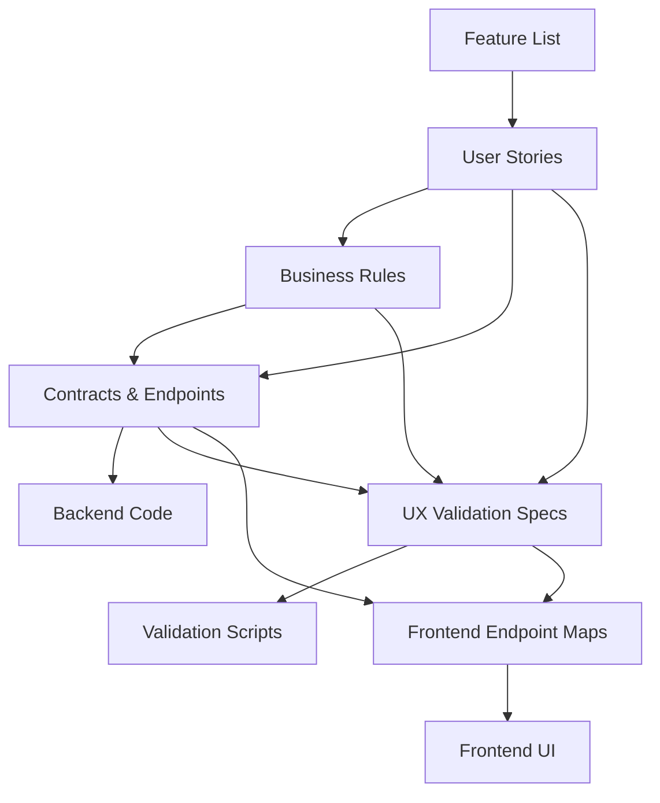
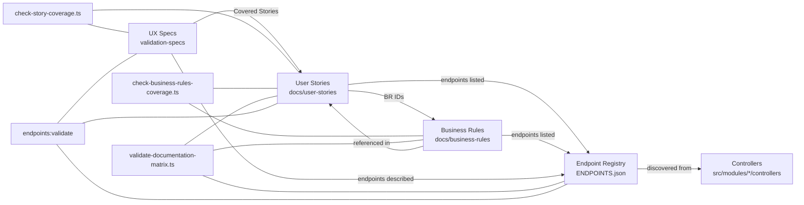
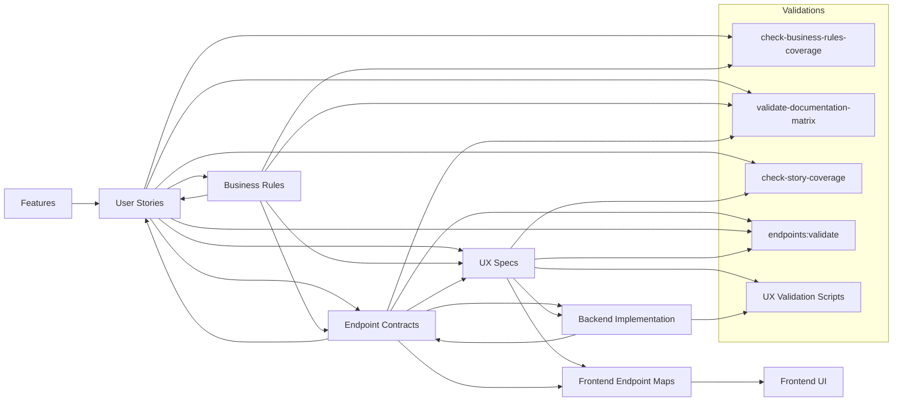

# Backend Validation System – End‑to‑End Manual

> **Goal:** Make every backend so well‑specified and validated that frontend work becomes mechanical wiring, not debugging.

This manual defines:

- The **artifacts** in your system (stories, rules, contracts, UX specs, code, frontend plans).
- The **matrix** that ties them together.
- The **phases** of work and what is allowed/forbidden in each.
- The **scripts** that enforce the matrix.
- The **rules** agents must follow so they cannot skip steps or “invent” behavior.

Backends built under this handbook are treated as **production services from day one**, even if no UI exists yet. The frontend may come later, but the backend must always be contract‑first, fully validated, and ready for real traffic.

If you are a **project manager starting a new project** and want a linear, prompt‑driven path, start with:

- `handbook/START-HERE-FOR-PMS.md`

That file gives you phase‑by‑phase prompts and checklists; this document provides the full technical and process detail behind them.

---

## 1. Big Picture – What We’re Building

You are not doing “tests after the fact.” You are creating a **self‑reinforcing specification system**:

- **Features** describe what the product does.
- **User Stories** describe what people need.
- **Business Rules** describe the “laws” those flows must obey.
- **Contracts** describe the HTTP / WebSocket boundaries.
- **Backend Code** implements those contracts.
- **UX Validation Specs** “virtually use” the app via APIs.
- **Frontend Endpoint Maps** describe which endpoints each screen will call.

Everything is cross‑linked and checked by scripts.

### 1.1 Relationship Matrix (High‑Level)



**Key idea:** no artifact stands alone. Each one is backed by, and checked against, the others.

---

### 1.2 Standard Stack Profiles (Do Not Guess)

This handbook is meant to be reusable, but you must **not** pick frameworks or layouts at random. You must detect which stack profile the repository uses and follow its rules exactly.

We support two profiles:

1. **Integrated Nx Backend (Standard Smackdab CRM Pattern)**  
   - Nx workspace at repo root (`nx.json`, `apps/`, `packages/`).  
   - Primary HTTP apps under `apps/*` using **Express** (for example `apps/api`).  
   - Shared code under `packages/*` (core, services, sequelize, cache, queue, logger, types).  
   - Contracts:
     - Root OpenAPI file (for example `openapi-spec.yaml`), plus  
     - Per‑app Swagger YAML/JSON under `apps/<app>/src/swagger/`.

2. **Single‑Service Backend (Smaller Projects or Microservices)**  
   - One main service (Express or Nest) with source under `src/` or `apps/<service>/src`.  
   - Contracts:
     - OpenAPI files under `openapi/` (YAML/JSON) are the **only** source of truth for HTTP contracts.  
     - The endpoint registry files `architecture/ENDPOINTS.json` / `architecture/ENDPOINTS.md` are
       **generated artifacts** produced by scripts that read the contracts and controllers. They are
       never the canonical contract and must not be hand‑edited to “define” endpoints.

**Detection rules (agents MUST follow):**

- If `nx.json` exists **and** there is an `apps/api` directory → treat it as an **Integrated Nx Backend**.  
- Within an Integrated Nx Backend:
  - Contracts come from:
    - `openapi-spec.yaml` at the repo root (if present), and  
    - `apps/<app>/src/swagger/*.yaml` / `*.json` for per‑app details.  
  - Do **not** introduce `architecture/ENDPOINTS.json` unless it already exists and has explicit instructions.
- If there is no `nx.json` but `architecture/ENDPOINTS.json` exists → treat it as a **Single‑Service Backend** and:
  - Use OpenAPI files under `openapi/` as the contracts, and  
  - Treat `architecture/ENDPOINTS.json` / `ENDPOINTS.md` strictly as generated views over those contracts
    plus the implemented controllers.
- If neither pattern is present, stop and request explicit human guidance rather than inventing a structure.

All new work for Smackdab’s main CRM and adjacent services should default to the **Integrated Nx Backend** pattern unless you are explicitly told to create a stand‑alone single‑service backend.

---

## 1.2 API‑First TDD – Non‑Negotiable Foundation

All work in this repo follows **API‑First Test‑Driven Development**. That means:

- We design and agree on **contracts** (OpenAPI/DTOs – with the endpoint registry generated from them) **before** we implement backend behavior.
- We write **tests at the API boundary first** (validation specs + validators), then write backend code to make those tests pass.
- We treat tests and specs as the **executable form of the contract**.

### 1.2.1 API‑First

API‑First here means:

1. Start from stories & rules, then define contracts:
   - User Stories → Business Rules → Endpoint Contracts (OpenAPI + DTOs).  
   - The endpoint registry (`architecture/ENDPOINTS.json` / `ENDPOINTS.md`) is **generated from those
     contracts and the implemented controllers**; it is never the place where contracts are authored.
2. Contracts (OpenAPI + DTOs) are the single source of truth for:
   - Methods, paths, field names, required/optional fields, status codes.
3. Backend implementation must follow contracts:
   - HTTP controllers/handlers and services must not silently diverge from the documented contracts.

#### 1.2.3 Contract-first edit checklist (applies to agents and humans)

Before touching UX specs, validators, registry files, or controllers, you **must**:

1. Identify the endpoint(s) in OpenAPI (`openapi/…` or `apps/*/swagger`).
2. Run `npm run show:endpoint -- 'METHOD /path'` to print the canonical contract block.
3. Inspect the matching controller/DTO to confirm fields and status codes.
4. Only then edit specs/tests.
5. After edits: `npm run openapi:bundle` (if contracts changed) → `npm run endpoints:validate` →
   `npx ts-node docs/test-plans/scripts/validate-ux-specs-against-contracts.ts`.

Registry files (`architecture/ENDPOINTS.json` / `.md`) are generated outputs of these steps. Never treat
them as the source of truth; regenerate them via the scripts instead of editing by hand.

When we change behavior, we change **contracts + specs + tests** in a controlled way, then code.

### 1.2.2 TDD at the API Boundary

TDD in this system means:

1. **RED – Write or update the tests/specs first**
   - For a new feature or change:
     - Update User Stories and Business Rules.
     - Update contracts (OpenAPI/DTOs) so they reflect the new behavior, including any
       `x-acceptance-criteria` or similar metadata linking AC IDs to operations.
     - Update UX specs to describe the new behavior.
     - Update or add validation scripts that exercise this behavior via HTTP and assert against the
       contracts.
   - Run validators and matrix scripts → they must fail initially.

2. **GREEN – Implement the minimum backend code**
   - Change controllers/services/models only to the extent needed to make the validators pass while keeping contracts intact.
   - Rerun validators; when they pass, the behavior is implemented as specified.

3. **REFACTOR – Improve structure without changing behavior**
   - Refactor internal code, keeping all validators and matrix checks green.

**Important:**

- We do **not** add or change backend behavior without a corresponding spec + validator change that fails first.
- We do **not** change validators/specs purely to “make tests green” when the contract is wrong; we instead:
  - Fix the contract, or
  - Fix the backend to match the contract.

This is the backbone: every phase described below assumes API‑First TDD. Stories/Rules → Contracts → Specs/Tests → Code → Refactor.

There is **no “throwaway prototype” mode** in this system:

- Every backend built with this handbook is expected to be production‑grade.  
- The only thing that is allowed to lag is the UI.  
- UX validation flows “virtually use” the app via APIs to prove the backend is ready before frontend work starts.

---

### 1.3 Checks & Balances That Enforce API‑First TDD

To prevent agents from skipping steps or “fixing tests to fit the code,” we add explicit **checks & balances**. For every type of change, there is a required upstream artifact and a script that must pass.

#### 1.3.1 Change Matrix (What You Touch → What Must Exist/Pass)

| If you want to change… | You MUST first have… | And you MUST run… |
|-------------------------|----------------------|--------------------|
| Add/modify a **User Story** | Clear feature rationale | `check-business-rules-coverage` (US ↔ BR), fix until green |
| Add/modify a **Business Rule** | At least one `US-xxx` story that needs it | `check-business-rules-coverage` (no undefined/unreferenced rules) |
| Add/modify an **Endpoint** in controllers/DTOs | Stories + rules that justify it, and an updated OpenAPI operation for that endpoint | `endpoints:validate` (controllers ↔ contracts) and `validate-ux-specs-against-contracts` (specs ↔ contracts) |
| Add/modify a **Contract** (OpenAPI/DTOs) | Stories + rules updated to match | `validate-ux-specs-against-contracts` and `check-acceptance-coverage` (AC IDs ↔ contracts), fix until green |
| Add/modify a **UX Spec step** | Existing story IDs, rules, and contracts for that endpoint | `check-story-coverage`, `validate-documentation-matrix` (stories/rules ↔ generated endpoint list), and `validate-ux-specs-against-contracts` |
| Add/modify a **UX Validator script** | A spec that already describes the steps | The corresponding `validate-*-full.ts` and `run-all-with-logs.sh` |
| Add/modify **Backend Code** behavior | A failing spec/test that expresses the desired behavior | Relevant `validate-*-full.ts` (must go from red → green) and `endpoints:validate` (to keep generated registry in sync) |
| Add/modify a **Frontend Endpoint Map** | Validated backend (all relevant validators green) and UX specs | `validate-documentation-matrix` (no new endpoints in maps without contracts) and `validate-ux-specs-against-contracts` |

**Rule of thumb:**

- If you touch **code**, there must already be a **spec + validator** that fails without that change.
- If you touch a **spec**, it must be backed by **stories, rules, and contracts** and validated by the matrix and UX linters.

These checks & balances are what turn “API‑First TDD” from an idea into an enforceable workflow.

#### 1.3.2 CRITICAL – No Placeholders, No “Fast Pass” Contracts

- Agents must **never** insert placeholder or generic contracts, DTOs, or schemas just to get tools
  (bundlers, endpoint validators, matrix scripts) to pass.  
- It is forbidden to:
  - Add “dummy” request/response bodies or generic `object` schemas to OpenAPI just to make
    `openapi:bundle` succeed.  
  - Pre‑populate path files with fake fields “to wire it up later.”  
  - Mark endpoints as documented/complete in `ENDPOINTS.json` while payloads, status codes, or
    AC/BR links are still guesses.
- If the real shape of a contract is not yet known:
  - Do **not** add the operation as if it were final.  
  - Either leave it out of the contracts or explicitly mark it as `future` and stop; surface the
    gap for a decision instead of “filling in” details.  
- Passing validations with inaccurate data is treated as a **failure of process**, not a success:
  - All bundles and validators must reflect actual, DTO‑backed behavior and real Acceptance
    Criteria, not placeholders.

In any conflict between speed and doing the work correctly the first time, **correctness is
non‑negotiable and always wins**. Agents must not compress phases, skip steps, or introduce
temporary shortcuts to appear “done.”

---

### 1.4 Interaction Model & Question Handling

This system assumes a **project‑manager ↔ developer** relationship:

- The human user is effectively the **project manager**.
- The agent is the **developer** who executes work within these rules.

**Question prompts (`?`):**

- When a user message contains a `?`, treat it as an information request **only**.
- You may:
  - Read files.
  - Run read‑only commands.
- You must **not**:
  - Modify files.
  - Change configuration.
  - Start/stop services.
until the user gives an explicit non‑question instruction.

**Verification before assertion:**

- Never present assumptions as facts.
- Always verify:
  - File contents.
  - Service status.
  - Script outputs.
- If something cannot be verified, mark it explicitly as an assumption.

**Destructive operations:**

- Require explicit user permission before:
  - Deleting data or files.
  - Dropping databases.
  - Changing ports or core configuration.

These interaction rules apply to every phase of the process.

---

### 1.5 Roles and Autonomy Rules (User vs Agent)

This handbook treats you (the human) and the agent as distinct roles with different responsibilities and decision rights.

#### 1.5.1 Human Partner / Product Owner / Project Manager

You own the **business direction** and final calls:

- Define and approve **features, user stories, and business rules**.  
- Approve any change that affects:
  - External behavior users experience.  
  - Public contracts (API shape, payloads, status codes, events).  
  - Data model and persistence rules.  
  - Global standards or the handbook itself.  
- Decide when a **phase is complete** based on evidence (scripts, logs, docs).  
- Set guardrails: what is allowed or forbidden for this project.

#### 1.5.2 Agent / Implementation Partner

The agent owns the **mechanical execution** within the boundaries you set:

- Writes and updates:
  - Tests and validation scripts.  
  - Backend code.  
  - Supporting documentation and progress trackers.  
- Runs validation tools and interprets their output.  
- Maintains traceability:
  - Stories → rules → contracts → UX specs → validators → logs.  
- Proposes options and trade‑offs but does **not** make unapproved high‑level decisions.

The agent must always respect:

- This handbook (System Delivery Playbook).  
- API‑First TDD (tests/specs fail first, then code).  
- The interaction rules in §1.4.

#### 1.5.3 When the Agent May Work Autonomously

The agent may proceed without pausing for new instructions **only when all are true**:

1. **Within an Approved Phase and Scope**  
   - The current phase is explicitly agreed (for example, “Phase 1 – Stories & Business Rules”).  
   - The work stays inside that phase’s goal (for example, removing undefined rule IDs).

2. **Local, Reversible Changes**  
   - Changes are confined to the files and features already in scope.  
   - They are easy to revert (no destructive data changes, no irreversible migrations).

3. **No Change to Business Intent**  
   - No changes to the meaning of:
     - User stories.  
     - Business rules.  
     - Contracts (methods, paths, fields, status codes, side effects).  
   - Wording may be clarified for grammar, but behavior must not change.

4. **No New Global Rules or Standards**  
   - The agent does **not**:
     - Invent new handbook rules.  
     - Reclassify rules as “optional”, “future”, or “advanced”.  
     - Declare a phase “done” beyond reporting raw technical status.

If any of these conditions are not satisfied, the agent must stop and ask for direction.

#### 1.5.4 When the Agent Must Stop and Ask You

The agent **must pause and get explicit approval** before proceeding when any of the following apply:

1. **Changing Business Behavior or Scope**  
   - Adding, removing, or materially changing a user story.  
   - Adding, removing, or materially changing a business rule.  
   - Changing acceptance criteria that affect real‑world outcomes.

2. **Changing Contracts or Public Interfaces**  
   - Adjusting API endpoints (paths, methods, required parameters).  
   - Changing request/response shapes or event schemas.  
   - Removing or relaxing error behaviors that clients rely on.

3. **Changing Global Architecture or Standards**  
   - Selecting or switching frameworks or libraries.  
   - Changing directory structure or module layout standards.  
   - Modifying shared systems such as auth, tenancy, logging, messaging.  
   - Editing the handbook itself in ways that change rules or phases.

4. **Declaring Phases “Complete” or Reclassifying Work**  
   - Stating that a playbook phase is “complete” beyond reporting script results.  
   - Classifying rules or features as “future”, “optional”, or “out of scope”.

5. **Conflicting or Ambiguous Inputs**  
   - When stories, rules, contracts, UX specs, or code disagree.  
   - When tool output conflicts with your stated expectations.  
   - When instructions appear to conflict with this handbook.

6. **High‑Risk or Irreversible Actions**  
   - Data migrations, destructive changes, or compatibility‑breaking updates.  
   - Any change that could impact running systems beyond the local dev environment.

When in doubt, the agent must treat the situation as requiring your decision, present the options and trade‑offs, and wait for your explicit choice before proceeding.

---

### 1.6 AI Tooling Integration

This playbook is designed to work with AI-assisted development. The specific tools, agents, and skills to use at each phase are documented separately to keep the core playbook portable.

**See:** `handbook/tooling/CLAUDE_CODE_INTEGRATION.md` for the complete phase-by-phase guide to which AI tools to invoke.

**Key Principles (tool-agnostic):**

1. **Planning phases (0-2)** use AI for requirements gathering, story/rule authoring, and contract design.
2. **Specification phases (3-4)** use AI for UX spec authoring and validation script design.
3. **Implementation phases (5+)** use AI for code generation, with mandatory automated review.
4. **Every phase** has specific validation scripts that must pass before proceeding.

The AI must **never**:
- Invent new user stories or business rules without approval.
- Change contracts without upstream changes to stories/rules.
- Reinterpret or simplify acceptance criteria.
- Skip validation scripts to "move faster."

When contradictions are detected between code, contracts, specs, or stories, the AI must escalate to the human for a decision rather than picking a resolution autonomously.

---

### 1.6.1 Chain of Trust Enforcement

This project implements automated monitoring that enforces the playbook through evidence-based validation.

**Components:**
- **Validation Registry:** `scripts/validation/validation-registry.json` - Single source of truth for all validation results
- **Phase Gates:** Automated checks that block phase progression until all required validators pass
- **Claude Hooks:** `.claude/hooks.json` - Pre-commit enforcement that blocks commits without validation

**How it works:**
1. Validation scripts execute UX specs and record results in the registry
2. Phase gates read the registry to determine if phases are complete
3. Claude hooks intercept git commits and block them if validations weren't run
4. PM dashboard reads the registry to show real-time status

**See:** `handbook/monitoring/` for complete documentation:
- `monitoring/README.md` - Overview and quick reference
- `monitoring/CHAIN_OF_TRUST.md` - Architecture and philosophy
- `monitoring/CLAUDE_HOOKS.md` - Pre-commit enforcement details
- `monitoring/VALIDATION_REGISTRY.md` - Registry schema and API
- `monitoring/PHASE_GATES.md` - Phase completion requirements

**Agent Requirements:**
1. Run `npm run validation:all` before every commit that touches `src/` or `scripts/`
2. Check phase gate status before claiming phase completion: `npm run validation:gates`
3. When commits are blocked, fix issues and re-run validation (never bypass hooks)
4. Never manually edit the validation registry or hook configuration

**Core Principle:** Status is computed from evidence, never claimed by agents.

---

## 2. Core Artifact Types and Locations

### 2.1 User Stories

- **Location:** `docs/user-stories/*.md`
- **Example file:** `docs/user-stories/01-authentication-stories.md`
- **Format:**
  - `## US-101: New User Registration`
  - **Acceptance Criteria** block (the authoritative checklist for when this story is “done”).  
  - Optional `**API Endpoints**:` section listing endpoints (e.g., ``POST /auth/register``).
  - Optional references to business rules by ID (`BR-xxx`) when the story depends on shared system‑wide rules (auth, roles, quotas, etc.).

> **Important:** Every story **must** have clear Acceptance Criteria; Business Rules are **global laws**, not a requirement for every individual story.

For detailed templates and authoring rules, see:

- `handbook/stories/USER_STORY_AUTHORING_GUIDE.md`

### 2.2 Business Rules

- **Location:** `docs/business-rules/*.md`
- **Example file:** `docs/business-rules/01-authentication-rules.md`
- **Format:**
  - `## BR-101: [Title]`
  - Narrative rule + references to:
    - Stories (`US-xxx`) where applicable.
    - Endpoints (inline code: ``POST /auth/register``).

For detailed categories, structure, and authoring rules, see:

- `handbook/rules/BUSINESS_RULE_AUTHORING_GUIDE.md`

### 2.3 Endpoint Contracts / Registry

- **Location:**
  - `architecture/ENDPOINTS.json` – machine‑readable registry.
  - `architecture/ENDPOINTS.md` – generated human doc.
- **Generated by:** endpoint validation scripts:
  - `npm run endpoints:validate`
  - `npm run endpoints:migrate`
  - `npm run endpoints:audit`

Each endpoint entry knows:

- Method, path.
- Implementation file + line (`src/modules/...`).
- Business rules (`businessRules` field).
- Story/test coverage (`testedBy` field).
- Status: complete / partial / missing / future.

**Contract authoring template for agents:**

- New or updated API contracts must be derived from:
  - The System Delivery Playbook (stories, rules, phases), and  
  - The master contract template:  
    - `handbook/contracts/MASTER_API_TEMPLATE_v5_AGENT.yaml`
- Agents must not invent authentication models, envelopes, or bulk patterns; they must follow the template’s rules for:
  - Auth (cookie vs header).  
  - Tenancy (session‑derived context, no tenant headers).  
  - Response envelope (`{ data, message, toast, responseType }`).  
  - Bulk operations (`{ items: [...] }`), pagination, and soft‑delete patterns.

### 2.4 UX Validation Specs (User Experiences)

- **Location:** `docs/test-plans/validation-specs/*.md`
- **Examples:**
  - `01-authentication.md`
  - `02-onboarding-workspaces.md`
  - `03-channel-operations.md`
  - …
  - `11-multi-chat.md`
- **Required parts:**
  - `## Covered Stories` section with `[US-XXX]` entries.
  - Detailed workflows with:
    - Endpoint.
    - Body.
    - Headers.
    - Expectations / capture / verify steps.

### 2.5 Validation Scripts (Executable Validators)

- **Location:**
  - Endpoint/coverage: `scripts/*.ts`, `docs/test-plans/scripts/*.ts`
  - UX flows: `scripts/validation/*.ts`
- **Examples:**
  - Story ↔ UX coverage: `scripts/check-story-coverage.ts`
  - Story ↔ Rule coverage: `docs/test-plans/scripts/check-business-rules-coverage.ts`
  - Endpoint ↔ Story/Rule coverage: `docs/test-plans/scripts/validate-documentation-matrix.ts`
  - UX flow validators:
    - `scripts/validation/validate-auth-full.ts`
    - `scripts/validation/validate-onboarding-full.ts`
    - …
    - `scripts/validation/run-all-with-logs.sh`

Each UX script:

- Calls the real backend (`BASE_URL` or `.env`).
- Executes each spec step.
- Logs **full request + response** to `scripts/validation/logs/<spec>-TIMESTAMP.log`.

### 2.6 Process Rules (Rulebooks)

- **Location:**  
  - UX validation rulebook: `handbook/RULEBOOK.md`  
  - Spec authoring rulebook: `handbook/SPEC_RULEBOOK.md`

These define **hard constraints** on what agents may or may not do.

### 2.7 Contracts as Code & TypeScript‑Only Backend

This system treats contracts as code:

For the **Integrated Nx Backend** pattern:

- **OpenAPI**:
  - Root spec: `openapi-spec.yaml` at the workspace root (when present), and
  - Per‑app specs: `apps/<app>/src/swagger/*.yaml` bundled to JSON via the `doc:generate*` scripts.
- **DTOs & Types**:
  - Defined in the app and shared packages:
    - `apps/<app>/src/modules/*` (controllers, validation schemas, DTOs), and
    - `packages/*` (core types, services, repositories).

For the **Single‑Service Backend** pattern (when a project uses it):

- **OpenAPI**:
  - One or more files under `openapi/` and/or `openapi/generated/`.
- **Endpoint Registry** (if present):
  - `architecture/ENDPOINTS.json` plus generated docs like `architecture/ENDPOINTS.md`.
- **DTOs & Types**:
  - `src/modules/*/dto/*.ts` or the project’s documented DTO location.

These contract sources must always agree for the active profile:

- Every path/method in OpenAPI must correspond to a real route handler.  
- If a registry (`ENDPOINTS.json`) exists, every registry entry must match a route and a contract entry.  
- For each endpoint, request/response fields in OpenAPI must match the DTOs/validation schemas and handler behavior.  
- Controllers/handlers and services must not accept or return fields that are not in the contract.

**TypeScript‑Only Rule:**

- All backend code and validation scripts are written in TypeScript (`.ts`).
- No new JavaScript (`.js`) files may be added.
- Shared types and DTOs are defined once and reused across controllers/services/tests.

**When changing contracts:**

- First update stories & rules.
- Then update OpenAPI + `ENDPOINTS.json` and DTOs together.
- Only then implement or adjust controller/service logic.
- Finally, update specs/validators and run the full validation matrix.

### 2.8 Test Environment & `.env` as Law

The test environment must mirror real deployment as closely as possible.

- Use `docker-compose.yml` to run Postgres + Redis.
- Run migrations and seeders as documented (never hand‑edit DB state for tests).

**`.env` is the single source of truth for configuration:**

- Ports (`PORT`, `POSTGRES_PORT`, `REDIS_PORT`, etc.)
- Hosts (`POSTGRES_HOST`, `REDIS_HOST`)
- Credentials and URLs

All code and scripts must read configuration from environment variables, not hard‑coded values:

- Backend uses config modules (e.g. `src/common/services/redis.service.ts`) that respect `process.env`.
- Validation scripts load `.env` (via `dotenv`) and/or respect `BASE_URL` and `REDIS_*` so they run in any environment.

**Never:**

- Hardcode ports or URLs in code, specs, or tests.
- Change ports in code without updating `.env` and relevant docs.

**Port and service registry rules (for multi‑service environments):**

- Always check the central service registry before choosing ports.
- Never start services on ports other than those specified in `.env` (or in the registry).
- If a service is already running on the configured port, assume it is the **correct** instance; do not start a duplicate on a different port.

In a multi‑service system, apply these rules per service:

- Each service has its own configuration derived from `.env` (or a central config system).  
- Cross‑service UX flows must still consume services only through their documented contracts and configured endpoints.

---

### 2.9 DRY in This System

DRY here means **no competing sources of truth** in any project using this rulebook.

- Endpoints are defined once in contracts:
  - `ENDPOINTS.json` + OpenAPI.
  - Stories, rules, specs, and endpoint maps reference them; they do not redefine them.
- Business rules are defined once by ID (`BR-xxx`), then referenced wherever needed.
- DTOs define payload shape once; specs and validators copy from DTOs, not invent their own fields.

**Practical DRY guidelines:**

- When adding a new field to an endpoint:
  - Change DTOs + OpenAPI + `ENDPOINTS.json` together.
  - Update specs to show examples, but do not diverge from DTOs.
- When adding a new story:
  - Reference existing rules/endpoints where possible instead of duplicating text.

The goal is that any question (“what does this endpoint expect?”) has exactly one canonical answer in code/contracts, and everything else points to it.

### 2.10 Coding Style & Security

To keep codebases consistent and safe across projects using this handbook:

- **File size & structure:**
  - Aim to keep files under ~300 lines unless there is a strong reason not to.
  - Prefer splitting large modules into focused pieces rather than accumulating unrelated logic.

- **Indentation & formatting:**
  - Use **2‑space indentation** for TypeScript and YAML unless a project explicitly specifies otherwise.
  - Preserve existing naming and style conventions within each project.

- **Comments:**
  - Only add comments where they help explain complex logic or contracts.
  - Do not restate obvious behavior in comments.

- **Security:**
  - Never hardcode secrets or credentials.
  - Avoid obvious vulnerabilities (XSS, SQL injection, command injection, etc.).
  - Validate inputs at all layers; prefer DTO validation and centralized guards.
  - If you introduce insecure code, treat fixing it as a priority task.

### 2.11 Documentation Hygiene & File Organization

Documentation should be deliberate and organized:

- Only create new documentation files (markdown, READMEs, etc.) when there is an explicit need or request.
- Place manuals and rulebooks under `handbook/` so they are portable across projects.
- Place project‑specific test plans under `docs/test-plans/` and not in the project root.
- Do not create ad‑hoc docs in root directories; always use existing doc folders or ask for guidance on where new docs belong.

This keeps repositories tidy and makes it easier to reuse the handbook across multiple services.

---

### 2.12 Backend Directory Layout & Validation (Summary)

- All new Integrated Nx backends must follow the backend v2 directory layout (apps under `apps/`, shared code under `packages/`, infra under `config/`, `docker/`, `scripts/`, `sql/`, etc.).  
- A directory‑structure validator (`scripts/validate-directory-structure.ts`) is mandatory and must run locally and in CI.  
- Full details and examples live in: `handbook/architecture/DIRECTORY_LAYOUT_AND_VALIDATION.md`.

---

### 2.13 Authentication System (Summary)

- All new projects must implement the modular auth pattern (`IAuthProvider`, `StandaloneAuthProvider`, `AuthProviderFactory`, future `SmackDabAuthProvider`).  
- Auth endpoints and payloads must be consistent (`/auth/register`, `/auth/login`, `/auth/me`, `/auth/logout`) so central SSO can be plugged in later.  
- Full details and shapes live in: `handbook/auth/MODULAR_AUTH_SYSTEM.md`.

---

### 2.14 Tenant Model – Organization and Workspace (Summary)

- Canonical tenant model is Organization + Workspace; new projects must not introduce new “branch” concepts.  
- Backend v2’s `Branch` model is treated as the legacy equivalent of Workspace for migration and interop.  
- Tenant context (`organizationId`, `workspaceId`) must be carried through sessions, messages, logs, and metrics.  
- Full details live in: `handbook/tenancy/ORGANIZATION_WORKSPACE_MODEL.md`.

---

### 2.15 Messaging Standard – Pulsar Only (Summary)

- Pulsar is the only allowed messaging system for new work; RabbitMQ is legacy and must not be used for new features.  
- Messages follow the `{ ACTION, DATA }` pattern with tenant context in `DATA`.  
- Topic definitions and Pulsar configuration must be centralized and driven by env vars.  
- Full details live in: `handbook/messaging/PULSAR_MESSAGING_STANDARD.md`.

---

### 2.16 Logging and Tracing (Summary)

- All services must use structured logging (Winston or equivalent) with consistent fields (timestamp, service, level, correlationId, tenant context).  
- Correlation IDs must be generated or propagated for every request and passed through HTTP, messaging, and logs.  
- Full details live in: `handbook/logging/LOGGING_AND_TRACING_STANDARD.md`.

---

### 2.17 Error Handling and Response Envelope (Summary)

- All HTTP responses must use a consistent envelope (data, message, toast, responseType) via a helper similar to `generalResponse`.  
- `HttpException` (or equivalent) must be the standard error type, mapped into the envelope and OpenAPI error schemas.  
- Full details live in: `handbook/errors/ERROR_HANDLING_AND_RESPONSE_ENVELOPE.md`.

---

### 2.18 Configuration and Environment Model (Summary)

- Configuration must come from environment variables (or a central config service) and be validated at boot time.  
- Env var naming must follow shared patterns (`*_HOST`, `*_PORT`, `*_URL`, etc.); no hard‑coded secrets or endpoints.  
- Full details live in: `handbook/config/CONFIGURATION_AND_ENVIRONMENT_MODEL.md`.

---

### 2.19 Permissions and Authorization (Summary)

- Authorization must be layered on top of the tenant model and implemented via shared guards/middleware, not ad‑hoc checks.  
- Feature gating and experiments (Statsig) must be handled through shared helpers and must not be used to bypass contracts/tests.  
- Full details live in: `handbook/permissions/PERMISSIONS_AND_AUTHORIZATION_MODEL.md`.

---

### 2.20 Caching and State Management (Summary)

- Caching must follow the L1/L2/L3 pattern (in‑memory LRU, Valkey/Redis, DB) with centrally defined keys/configs.  
- All cache access must go through the cache manager; invalidation strategies must be explicit for each cache.  
- Full details live in: `handbook/caching/CACHING_AND_STATE_MANAGEMENT.md`.

---

### 2.21 Feature Flags and Experiments (Summary)

- Internal feature flags and external experiments (Statsig) must be evaluated through shared helpers.  
- Flags must not be used to hide failing behavior from tests or to break API contracts.  
- Full details live in: `handbook/flags/FEATURE_FLAGS_AND_EXPERIMENTS.md`.

---

### 2.22 Database Schema and Migrations (Summary)

- All schema changes must go through migrations; models and migrations must stay in sync.  
- Breaking changes must be coordinated with contracts, DTOs, and UX specs, and rolled out carefully.  
- Full details live in: `handbook/schema/DATABASE_SCHEMA_AND_MIGRATIONS.md`.

---

### 2.23 Observability, Health, and Metrics (Summary)

- Every service must expose a health endpoint, basic metrics (per‑endpoint and per‑queue), and traces using OpenTelemetry or equivalent.  
- Alerts must fire on health failures, elevated error rates, and SLO violations.  
- Full details live in: `handbook/observability/OBSERVABILITY_HEALTH_AND_METRICS.md`.

---

### 2.24 CI/CD Validation Pipeline (Summary)

- Every project must wire linting, directory validation, docs/matrix checks, and tests into its CI pipeline.
- Pipelines must fail fast on lint or contract/test failures; no new service is "ready" until it passes these checks.
- Full details live in: `handbook/cicd/CI_CD_VALIDATION_PIPELINE.md`.

---

### 2.25 Testing Standards (Summary)

- All test data must be created through factories, never inline; factories centralize data creation and make tests maintainable when models change.
- All database tests must use transaction rollback or table truncation to ensure test isolation; tests must never pollute each other.
- Tests must be completely independent with no shared mutable state and no order dependency.
- Every model used in tests must have a corresponding factory in `test/factories/`.
- Full details live in: `handbook/testing/TESTING_STANDARDS.md`.

---

## 3. The Cross‑Linked Matrix – How It Reinforces Itself

## 3. The Cross‑Linked Matrix – How It Reinforces Itself

### 3.1 Relationship Diagram with Scripts



**What this gives you:**

- Stories without rules: flagged.
- Rules not used by any story: flagged.
- Endpoints not referenced by any story/rule: flagged.
- Endpoints referenced in docs but not in registry: flagged.
- Stories not covered in any UX spec: flagged.
- Endpoints that have no “tested” link: flagged.

The missing piece so far is **UX specs ↔ DTOs/OpenAPI**, which we’ll call out in the process section.

---

## 4. Phase Model (Non‑Linear, But Controlled)

You don’t want a dumb waterfall; you want **phases with feedback**. Think of it like this:



**Key point:** Every phase has scripts that **push back** if something drifts.

---

## 5. Phases and Gates – What Agents May / Must / Must Not Do

### Phase 0 – Feature List

- **Goal:** Clarify the big pieces (Auth, Workspaces, Channels, Messaging, Files, Collaboration, Admin, DM, Multi‑Chat).
- **Artifacts:**
  - Informal docs (e.g. architecture diagrams).
- **Agents:**
  - May discuss and draft features.
  - Must not touch specs, contracts, or code yet.

### Phase 1 – User Stories and Business Rules

**Goal:** Turn features into stories and laws.

1. **Create/Update User Stories**
   - Files: `docs/user-stories/*.md`
   - Requirements:
     - Each story has a `US-xxx` ID.
     - Story lists relevant endpoints **only after contracts exist** (see Phase 2).

2. **Create/Update Business Rules**
   - Files: `docs/business-rules/*.md`
   - Requirements:
     - Each rule has a `BR-xxx` ID.
     - Rules reference US IDs where appropriate.

3. **Run coverage validation:**
  - `npx ts-node docs/test-plans/scripts/check-business-rules-coverage.ts`
    - Fails if:
      - Story has no rule.
      - Rule is unreferenced.
      - Referenced rule is undefined.

**Agents MAY:**

- Add/modify stories and rules.

**Agents MUST:**

- Keep US ↔ BR references up to date.
- Fix all issues reported by `check-business-rules-coverage.ts`.

**Agents MUST NOT:**

- Add stories or rules that reference endpoints not yet in contracts (Phase 2 guard).

**Required evidence for this phase:**

- `docs/test-plans/progress/STORY-RULES-STATUS.md` containing the latest output of
  `check-business-rules-coverage` (date/time, summary, and any remaining non‑critical issues).
  This file must show **no stories without rules** and **no undefined rules** before Phase 1
  is considered clean.

**When validation fails:**

- If a story is missing business rules:
  - For each `US-xxx`, add/link at least one `BR-xxx` in `docs/business-rules/*.md` that encodes its policy.
- If rules are unreferenced:
  - Either link each `BR-xxx` from an appropriate story or deprecate/remove it after review.
- If rules are undefined:
  - Define each referenced `BR-xxx` in the appropriate rules file or correct the story’s rule ID.
Then re-run `check-business-rules-coverage` until clean.

---

### Phase 2 – Endpoint Contracts and Registry

**Goal:** Define concrete HTTP/WS boundaries in the **contracts** and then generate a master endpoint
list from those contracts and the implemented controllers.

1. **Define / Update Contracts (OpenAPI + DTOs)**
   - Author and update HTTP contracts in OpenAPI only:
     - For single‑service backends: OpenAPI files under `openapi/` (and their bundled JSON).  
     - For Nx backends: root/per‑app OpenAPI as described in §1.2.1.
   - DTOs / validation schemas must match the OpenAPI definitions.
   - When agents generate or adjust OpenAPI/contract definitions, they **must** follow:
     - The master contract template: `handbook/contracts/MASTER_API_TEMPLATE_v5_AGENT.yaml`
     - The auth/tenancy/response envelope rules in this playbook.
   - Each operation implementing API Acceptance Criteria must declare those AC IDs in contract
     metadata (for example via `x-acceptance-criteria: ["AC-US-101-1", ...]`).

2. **Generate Endpoint Registry from Contracts and Code**
   - Run the endpoint validation script to generate and refresh the registry:
     - `npm run endpoints:validate`
       - Parses controllers to find implemented endpoints.
       - Merges them with OpenAPI contracts and story/rule/AC references.
       - Writes `architecture/ENDPOINTS.json` and regenerates `architecture/ENDPOINTS.md`.
   - Treat `ENDPOINTS.json` / `ENDPOINTS.md` as **generated master lists**:
     - They provide a consolidated view (status, story/rule/AC links).  
     - They are **not** where contracts are authored and must not be manually edited to “add”
       endpoints.

3. **Run documentation and acceptance matrix (contracts‑first)**
   - `npx ts-node docs/test-plans/scripts/validate-documentation-matrix.ts`
     - Uses the generated endpoint list to flag:
       - Endpoints missing from stories or rules.
       - Endpoints referenced in stories/rules but not present in the generated registry.
   - `npx ts-node docs/test-plans/scripts/check-acceptance-coverage.ts`
     - Validates indexed Acceptance Criteria:
       - Reads `[API]` AC IDs from user stories.
       - Reads AC IDs from contracts/registry (updated to pull from contract metadata and the
         generated registry).
       - Optionally reads AC IDs from UX specs via `Covers Criteria`.

4. **Run naming convention validation (GATE):**
   - `npm run validate:naming`
     - Fails if:
       - Path parameters are not camelCase
       - Body/response fields are not snake_case
       - DTO properties are not snake_case
   - `npm run validate:openapi-dto`
     - Fails if:
       - OpenAPI field names don't match DTO property names
       - Field naming conventions are inconsistent between layers

**Naming Convention Reference:** See `handbook/contracts/NAMING_CONVENTIONS.md` for the complete standard.

**Agents MAY:**

- Modify controllers and DTOs.
- Update OpenAPI contracts.

**Agents MUST:**

- Ensure every contract operation:
  - Exists in OpenAPI and is implemented by a controller (or clearly marked as `future`).
  - Is referenced by at least one story and one business rule (or is explicitly marked as
    "internal/infra").
  - Links to the appropriate `[API]` Acceptance Criteria IDs.
- Use `endpoints:validate` only to generate and verify the registry, never as the primary source of
  contract truth.
- Ensure all field names follow naming conventions:
  - Path parameters: camelCase (`{channelId}`)
  - Body/query/response fields: snake_case (`workspace_id`)
  - DTOs: snake_case properties

**Agents MUST NOT:**

- Invent endpoint references in stories/rules that do not match OpenAPI contracts.
- Treat manual edits to `ENDPOINTS.json` / `ENDPOINTS.md` as contract changes.

**Required evidence for this phase:**

- `docs/test-plans/progress/ENDPOINT-MATRIX-STATUS.md` capturing the latest
  `validate-documentation-matrix` output (counts of generated endpoints, endpoints missing
  from stories/rules, undefined endpoints). For Phase 2 to be clean:
  - There must be **no undefined endpoints** in stories/rules.
  - All P0/P1 endpoints must be covered by at least one story and one rule.
- `docs/test-plans/progress/AC-COVERAGE-STATUS.md` capturing the latest
  `check-acceptance-coverage` output for `[API]` Acceptance Criteria (see §2.1 and
  `handbook/stories/USER_STORY_AUTHORING_GUIDE.md`). For Phase 2 to be clean:
  - All critical `[API]` AC IDs must be referenced by at least one **contract operation** in
    OpenAPI (and therefore appear in the generated registry) or be explicitly documented as
    non‑API in the stories.
- `docs/test-plans/progress/NAMING-VALIDATION-STATUS.md` containing the latest
  `validate:naming` and `validate:openapi-dto` output. For Phase 2 to be clean:
  - All path parameters must be camelCase
  - All body/response fields must be snake_case
  - OpenAPI and DTO field names must align

**When validation fails:**

- If endpoints/contracts are not covered by stories:
  - Create or update `US-xxx` stories that reference those endpoints in `**API Endpoints**`, or
    classify them as internal/infra in the contracts/registry.
- If endpoints/contracts are not covered by rules:
  - Add or link appropriate `BR-xxx` rules and attach them at the contract/registry level
    (for example via business rule metadata).
- If undefined endpoints are referenced in stories/rules:
  - Fix typos or align the docs with real contracts, or implement and register the missing
    endpoints via OpenAPI and code.
Then re-run the matrix and AC coverage scripts until clean.

---

### Phase 3 – Backend Implementation (TDD Enforced)

**Goal:** Implement backend following strict TDD: Contract Tests → Unit Tests → Implementation → Integration Tests.

This phase enforces API-First TDD through four automated sub-phases with gates. The test pyramid is:

```
                    ┌─────────────────┐
                    │   E2E Tests     │  ← Phase 5 (UX Validators) - EXISTING
                    │   (API level)   │     100% spec coverage required
                    └────────┬────────┘
                             │
                    ┌────────┴────────┐
                    │  Integration    │  ← Phase 3.4 gate
                    │     Tests       │     Cross-module interactions
                    └────────┬────────┘
                             │
           ┌─────────────────┴─────────────────┐
           │         Unit Tests                │  ← Phase 3.2/3.3 gate
           │   (Services, Controllers, Utils)  │     90% coverage required
           └─────────────────┬─────────────────┘
                             │
      ┌──────────────────────┴──────────────────────┐
      │              Contract Tests                  │  ← Phase 3.1 gate
      │   (DTO validation, OpenAPI compliance)       │     100% endpoint coverage
      └──────────────────────────────────────────────┘
```

---

#### Phase 3.1 – Contract Tests (RED Phase)

**Goal:** Write contract tests BEFORE implementation. Tests validate DTOs and OpenAPI compliance.

**What gets created:**
- `test/contracts/dto/{module}.dto.spec.ts` - DTO validation tests
- `test/contracts/{module}.contract.spec.ts` - OpenAPI compliance tests

**Gate Script:** `npm run check:contract-coverage`
- Reads `architecture/ENDPOINTS.json`
- Scans `test/contracts/**/*.spec.ts` for endpoint references
- **EXIT 1** if any endpoint lacks contract test

**Threshold:** 100% of endpoints in ENDPOINTS.json must have contract tests.

**Registry Update:** Tracks `contractTestsPassed: boolean` in validation registry.

---

#### Phase 3.2 – Unit Tests (RED Phase)

**Goal:** Write unit tests for services/controllers BEFORE implementation. Tests MUST FAIL initially.

**What gets created:**
- `src/modules/{module}/services/__tests__/{service}.spec.ts`
- `src/modules/{module}/controllers/__tests__/{controller}.spec.ts`

**Gate Script:** `npm run check:red-phase -- {moduleName}`

**Key Design: Module-scoped, One-time Check**

The RED phase check is:
1. **Scoped to a specific module** - Not the entire test suite
2. **One-time per module** - Once verified, recorded in registry, never re-checked
3. **Skipped for existing modules** - Only applies to NEW modules being developed

**Registry tracks verified modules:**
```json
{
  "redPhaseVerified": {
    "bookmarks": { "verified": true, "timestamp": "2025-12-06T..." },
    "channel-groups": { "verified": true, "timestamp": "2025-12-06T..." }
  }
}
```

---

#### Phase 3.3 – Implementation (GREEN Phase)

**Goal:** Implement minimum code to make tests pass.

**Coverage Threshold:** 90% for all metrics (branches, functions, lines, statements)

**Gate Script:** `npm run check:unit-coverage`
- Runs `npm test -- --coverage --json`
- Parses coverage report
- **EXIT 1** if any metric below 90%

**Registry Update:** Tracks `unitTestsPassed: boolean` in validation registry.

**Agents MUST NOT:**
- Write implementation code before tests exist
- Skip failing tests
- Reduce coverage below 90%

---

#### Phase 3.4 – Integration Tests

**Goal:** Test cross-module interactions.

**What gets created:**
- `test/integration/{feature}.integration.spec.ts`

**Gate Script:** `npm run check:integration-coverage`

**Detection Strategy:**
Integration tests are required for cross-module interactions detected via:
1. **Explicit manifest** - `test/integration/integration-manifest.json`
2. **NestJS module graph** - Parsing `@Module()` decorators for imports
3. **Event emissions** - Scanning for `EventEmitter.emit()` calls

**Exclusions:**
- Infrastructure modules (database, cache, config) - not cross-module
- Shared utilities (common, utils) - not integration tests

---

#### Phase 3 – Combined Validations

After completing sub-phases, run all Phase 3 validations:

- **Contract‑level:**
  - `npx ts-node docs/test-plans/scripts/validate-ux-specs-against-contracts.ts`
    - Ensures UX specs only use operations and fields defined in OpenAPI.
  - `npx ts-node docs/test-plans/scripts/check-acceptance-coverage.ts`
    - Ensures `[API]` AC IDs referenced by contracts are defined in stories and, where required,
      covered by specs.
- **Implementation‑level:**
  - `npm run endpoints:validate`
    - Ensures that the generated endpoint registry matches both OpenAPI contracts and
      controllers (no implemented endpoints outside the contracts, no missing implementations).
- **TDD Gates:**
  - `npm run tdd:cycle` - Runs contract → unit → integration tests in order

**Agents MAY:**

- Implement and refactor backend code under the contracts.

**Agents MUST:**

- Follow TDD: write tests FIRST, then implementation
- Preserve OpenAPI/DTO contract shape unless there is a controlled upstream change (stories, rules,
  ACs, specs).
- Keep the generated endpoint registry accurate by re‑running `endpoints:validate` after contract
  or controller changes.
- Maintain 90% test coverage across all metrics.

**Agents MUST NOT:**

- Write implementation code before tests exist for NEW modules
- Change HTTP signatures (paths, methods, payload field names) without updating:
  - OpenAPI contracts (and DTOs).
  - Stories, business rules, and Acceptance Criteria references.
  - UX specs (after controlled review).
- Treat a green `endpoints:validate` run as sufficient on its own; contracts, AC/spec coverage,
  and TDD gates must also be green.
- Reduce test coverage below 90%.

**Required evidence for this phase:**

- `docs/test-plans/progress/ENDPOINT-REVIEW-STATUS.md` (already present) must be
  up‑to‑date and reflect the latest `endpoints:validate` run. Phase 3 is considered clean
  only if this file shows no missing or unclassified endpoints and accurately reports
  implementation/testing status.
- `docs/test-plans/progress/UNIT-TEST-COVERAGE.md` - Must show ≥90% coverage.
- `docs/test-plans/progress/CONTRACT-TEST-STATUS.md` - Must show 100% endpoint coverage.
- `docs/test-plans/progress/INTEGRATION-TEST-STATUS.md` - Must show cross-module coverage.
- Contract‑level validation reports (for example logs from `validate-ux-specs-against-contracts`
  and `check-acceptance-coverage`) must show:
  - No UX spec endpoints that are undefined in contracts.
  - No `[API]` AC IDs referenced by contracts that are missing from stories.

**When validation fails:**

- If `endpoints:validate` reports missing endpoints:
  - Decide per endpoint whether to implement it (matching the contract) or remove/deprecate it
    from the registry and contracts in a controlled way.
- If it reports unclassified endpoints:
  - Move them into the main `endpoints` array of `ENDPOINTS.json` via the scripts and ensure
    the corresponding OpenAPI/DTO definitions and story/rule/AC links exist.
- If `check:contract-coverage` reports missing contract tests:
  - Create `test/contracts/dto/{module}.dto.spec.ts` with DTO validation tests
  - Create `test/contracts/{module}.contract.spec.ts` with OpenAPI compliance tests
  - Rerun until 100% endpoint coverage
- If `check:red-phase` fails (tests passing when they should fail):
  - Tests are not testing meaningful behavior - rewrite to assert expected outcomes
- If `check:unit-coverage` reports coverage below 90%:
  - Identify uncovered files in coverage report
  - Add tests for uncovered paths
  - Rerun until ≥90% coverage
- If `check:integration-coverage` reports gaps:
  - Create `test/integration/{feature}.integration.spec.ts` for cross-module interactions
Re-run `endpoints:validate` and TDD gates until all are green.

---

### Phase 3.5 – Retroactive Documentation (Implementation-First Cleanup)

**Goal:** Document endpoints that were implemented before proper contracts existed.

This phase applies when:
- Endpoints exist in controllers but show as "unclassified" in validation
- Code was written before OpenAPI specs
- Legacy features need documentation alignment

**Process:**

1. **Create OpenAPI Contract First**
   - Add endpoint definition to `openapi/paths/{module}.yaml`
   - Include request/response schemas in `openapi/schemas/`
   - Add `x-acceptance-criteria` and `x-business-rules` metadata
   - Run `npm run openapi:bundle` to validate

2. **Add User Story Reference**
   - Add endpoint to existing user story in `docs/user-stories/*.md`
   - Or create new user story if feature is undocumented
   - Format: `- \`GET /path\`` under **API Endpoints** section
   - Ensure story has acceptance criteria and business rule references

3. **Regenerate Registry**
   - Run `npm run endpoints:validate`
   - Script will:
     - Detect the implemented endpoint from controllers
     - Match it with OpenAPI contract
     - Find user story reference
     - Promote from "unclassified" to "complete"

**Key Principle:**

An endpoint requires **both** OpenAPI contract AND user story reference to be considered
"documented". The validation script determines documentation status by:
- Scanning user story markdown files for backtick-formatted endpoint references
- Matching normalized paths (`:param` format) between stories, OpenAPI, and controllers

**When Unclassified Endpoints Remain:**

If endpoints stay in "unclassified" after adding documentation:
1. Verify endpoint format in user story matches controller exactly
2. Check that `@Controller()` decorator path + route path = expected full path
3. Ensure OpenAPI path uses `{paramName}` format (normalizes to `:param`)
4. Run `npm run endpoints:validate` with verbose output to debug matching

---

### Phase 4 – UX Validation Specs (User Journeys)

**Goal:** Define “virtual usage” of the entire app via APIs.

- **Artifacts:** `docs/test-plans/validation-specs/*.md`
- **Source Inputs:**
  - Stories (`docs/user-stories/*.md`).
  - Business Rules (`docs/business-rules/*.md`).
  - Contracts/registry (`architecture/ENDPOINTS.json`, DTOs, OpenAPI).
  - Backend behavior (controllers and services).

**Critical Rule:**  
**Specs must be derived from real contracts and code, not imagination.**

**Steps:**

1. **Design Experiences**
   - For each story group (Auth, Workspaces, Channels, etc.):
     - Design multi‑user workflows that:
       - Cover all stories (`US-xxx`) in that domain.
       - Respect all relevant rules (`BR-xxx`).
       - Use endpoints from the registry (`ENDPOINTS.json`).

2. **Write Specs**
   - In `validation-specs/*.md`:
     - Add `## Covered Stories` with `[US-xxx]`.
     - For each step:
       - `Endpoint`: MUST match registry and DTOs.
       - `Body`: fields MUST match DTOs and OpenAPI.
       - `Expectations`: statuses must match controllers/contract.

3. **Story coverage validation:**
  - `npx ts-node scripts/check-story-coverage.ts`
    - Fails if:
      - Any `US-xxx` is not in any `## Covered Stories`.

4. **Endpoint coverage validation (GATE):**
   - `npx ts-node scripts/check-endpoint-coverage.ts`
   - **This is a PASS/FAIL gate** - Phase 4 cannot complete until 100%.
   - Fails if:
     - Any endpoint in `ENDPOINTS.json` is not exercised in at least one UX spec.
   - Why this matters:
     - Story coverage ensures business requirements are tested.
     - Endpoint coverage ensures ALL API surface area is validated.
     - A story can be "covered" while its endpoints remain untested.

5. **Spec‑to‑contract validation:**
   - `npx ts-node docs/test-plans/scripts/validate-ux-specs-against-contracts.ts`
   - Fails if:
     - Spec references endpoint not in registry.
     - Spec body fields don't match DTOs/OpenAPI.

**Agents MAY:**

- Add/edit UX specs based on stories, rules, and actual DTOs.

**Agents MUST:**

- Use only fields present in DTOs/contracts.
- Reference only endpoints that exist in the registry.
- Update `## Covered Stories` accurately.

**Agents MUST NOT:**

- Introduce new fields or endpoints not present in contracts/DTOs.
- “Invent” behavior that backend doesn’t support and fail to mark it as future work.

**Required evidence for this phase:**

- `docs/test-plans/progress/UX-SPEC-COVERAGE.md` summarizing the latest
  `check-story-coverage` run (total stories, covered, missing). Phase 4 is clean only
  when this file shows **0 missing stories**.
- `docs/test-plans/progress/ENDPOINT-COVERAGE-STATUS.md` summarizing the latest
  `check-endpoint-coverage` run (total endpoints, covered, missing). **GATE requirement:**
  Phase 4 cannot complete until this shows **0 missing endpoints** (100% coverage).
- `docs/test-plans/progress/AC-COVERAGE-STATUS.md` – should show that all critical `[API]`
  AC IDs for in‑scope stories are referenced by at least one endpoint and at least one
  UX spec scenario (`Covers Criteria` lines), or are explicitly marked as non‑API.

**When validation fails:**

- If `check-story-coverage` reports missing stories:
  - For each `US-xxx`, add it to `## Covered Stories` in an appropriate spec and define at least one scenario that exercises it.
- If `check-endpoint-coverage` reports missing endpoints:
  - For each endpoint, add a scenario to an appropriate spec that exercises it.
  - Group endpoints by module (translation, presence, search, etc.) and create new spec files if needed.
  - Every endpoint must have at least ONE spec step that calls it with realistic data.
  - **This is a GATE** - do not proceed to Phase 5 until 100% coverage.
- If `validate-ux-specs-against-contracts` reports endpoints not in the registry:
  - Fix endpoint paths in specs to match `ENDPOINTS.json`, or implement and register the endpoints if they are intended but missing.
- If it reports unknown body fields:
  - Align spec JSON bodies with DTO/OpenAPI schemas or update contracts/DTOs to match intentional behavior.
Re-run these checks until clean.

---

### Phase 5 – UX Validation Scripts and Logs

**Goal:** Execute UX specs against the real backend and **record every call and response**.

- **Artifacts:**
  - `scripts/validation/validate-*.ts`
  - `scripts/validation/run-all-with-logs.sh`
  - `scripts/validation/logs/*.log`
  - Rulebook: `docs/test-plans/validation-specs/RULEBOOK.md`

**Rules (already codified in RULEBOOK.md):**

- Scripts must:
  - Follow specs step‑by‑step.
  - Use exact endpoints and payloads.
  - Log every request and response in a pretty format.

**Log format example (auth):**

```text
[2025-11-23T12:29:14.598Z] [REQUEST] POST /auth/register
Body: {
  "email": "alice.auth.1763900954598@example.com",
  "password": "Password123!",
  "name": "Alice Owner",
  "organization_name": "Main Org"
}
---
[2025-11-23T12:29:14.724Z] [RESPONSE] POST /auth/register -> 201
Body: {
  "data": {
    "session_id": "...",
    "user": { ... },
    "workspace": { ... }
  },
  "message": "Registration successful",
  "responseType": "success"
}
---
```

**Execution:**

- Single script:
  - `npx ts-node scripts/validation/validate-auth-full.ts`
- Full suite:
  - `./scripts/validation/run-all-with-logs.sh`  
    → logs in `scripts/validation/logs/*.log`.

**Agents MAY:**

- Implement validation scripts that wrap axios (HTTP client) with logging.
- Add more validators for new UX specs.

**Agents MUST:**

- Obey RULEBOOK.md:
  - No changing payloads to “make it pass.”
  - No synthetic tokens.
  - Log full request/response per step.
- Treat spec steps as contracts:
  - If backend behavior differs: log it and surface as a backend/contract issue.

**Agents MUST NOT:**

- Quietly adapt spec payloads to match current backend behavior.
- Hide failures by relaxing expectations without updating contracts/specs.

**Spec-to-Script Coverage Validation (GATE):**

- `npx ts-node scripts/check-spec-script-coverage.ts`
- **This is a PASS/FAIL gate** – Phase 5 cannot complete until 100% coverage.
- Fails if:
  - Any UX spec file has no matching validation script.
  - Any spec step is not executed by its validation script.
- Per RULEBOOK.md Rule 3: "Each spec has a single script that runs all its steps in order."
- Per RULEBOOK.md Rule 13: "Do not add steps not present in spec. Do not remove steps."
- Why this matters:
  - A validation script can "pass" while testing only a fraction of the spec.
  - The spec defines the contract; the script is the execution layer.
  - Without this gate, we can have green validators that don't actually test what the specs say.

**Required evidence for this phase:**

- `docs/test-plans/progress/UX-CONTRACT-ALIGNMENT.md` containing the most recent
  `validate-ux-specs-against-contracts` output. For Phase 5a (specs vs contracts) to be
  clean, this file must show:
  - No endpoints used in specs that are missing from `ENDPOINTS.json` (except those
    explicitly marked as FUTURE and documented as such).
  - No unknown body fields relative to the OpenAPI schemas for in‑scope endpoints.
- `docs/test-plans/progress/UX-VALIDATION-STATUS.md` summarizing the last
  `scripts/validation/run-all-with-logs.sh` run, listing each validator and whether it
  passed. Phase 5b (validators vs backend) is clean when all required validators are PASS
  or explicitly marked FUTURE with rationale.
- `docs/test-plans/progress/SPEC-SCRIPT-COVERAGE.md` summarizing the last
  `scripts/check-spec-script-coverage.ts` run. **GATE requirement:** Phase 5c (spec-to-script
  coverage) cannot complete until this file shows **100% coverage** for all spec files –
  meaning every spec has a script, and every spec step has a corresponding script call.

**When validation fails:**

- For spec-script coverage failures (`check-spec-script-coverage.ts`):
  - If a spec file has no script: create `scripts/validation/validate-{journey}-full.ts`.
  - If a script has fewer calls than spec steps: implement the missing steps in the script.
  - Each `### Step` or `#### N.N` entry in the spec MUST have a corresponding API call in the script.
  - Do not reduce spec steps to match a limited script – expand the script to match the spec.
- For any failing `validate-*-full.ts` script:
  - Inspect the corresponding log in `scripts/validation/logs/*.log` and compare spec step vs. request vs. response.
  - If contracts + specs + stories align but code is wrong: fix backend behavior.
  - If contracts/OpenAPI differ from specs: reconcile them (update contract/specs), then re-run matrix + UX checks.
  - If the step describes a future feature: mark it with `**[FUTURE]**` and do not expect validators to pass until implemented.

---

### Phase 6 – Frontend Endpoint Maps (Pre‑UI)

**Goal:** Turn validated UX flows into a page‑by‑page endpoint plan.

- **Artifacts (to be added):** e.g. `docs/frontend/endpoint-maps/*.md`
- **Source:**
  - UX flows (narrative).
  - Endpoint registry (mechanical).

**For each journey:**

- List UI screens/pages:
  - “Auth: Login screen”
  - “Onboarding: Workspace setup screen”
  - “Channel list: sidebar”
- For each screen:
  - Which endpoints are called.
  - In what order.
  - With what required data (session, workspace ID, channel ID).
  - What error states and alternate flows exist.

This document becomes the **API contract for the frontend**.

**Agents MAY:**

- Create endpoint maps only after backend validators are green.

**Agents MUST:**

- Use only endpoints from registry.
- Follow UX flows exactly; no “creative” shortcuts.

**Agents MUST NOT:**

- Introduce new endpoints or payload shapes in frontend without going back through:
  - Contracts → Specs → Validators.

**Required evidence for this phase:**

- `docs/frontend/endpoint-maps/README.md` describing, for each major user journey:
  - The pages/screens involved.
  - The endpoints each page calls, in order.
  - Required inputs (session/workspace/channel IDs) and expected error states.
  - A note that all referenced endpoints exist in `ENDPOINTS.json` and are exercised
    by UX specs. Frontend implementation should not begin until this map exists and
    is consistent with the contracts and UX flows.

---

### Phase 7 – Frontend UI Implementation

**Goal:** Build the actual UI with minimal backend surprises.

- **Frontend agents** should:
  - Treat endpoint maps and UX logs as the spec.
  - Avoid adding new API calls without contract changes upstream.

---

### Phase 8 – Frontend Feature Validation

**Goal:** Validate all frontend UI features work correctly against the backend before release.

This phase ensures that frontend implementation matches backend contracts and that all UI
features function as expected. Unlike backend validation (Phase 5), this phase tests the
actual user interface through manual or automated frontend testing.

1. **Create/Update Feature Catalog**
   - File: `frontend-poc/FEATURE-CATALOG.md` (or project-specific location)
   - Requirements:
     - Summary table with category-level counts (Total, Tested, Working, Broken, Untested)
     - Per-feature tables with columns: Feature | Element | Status | Notes
     - Bug tracking table with columns: File | Bug | Fix
     - API endpoints used section

2. **Create/Update Endpoint Map**
   - File: `frontend-poc/ENDPOINT_MAP.md`
   - Requirements:
     - Maps each backend endpoint to the frontend file that consumes it
     - Status tracking: Implemented / Pending / Partial
     - Must align with `architecture/ENDPOINTS.json`

3. **Run frontend validation:**
   - `node frontend-poc/scripts/validate-coverage.js`
     - Fails if any endpoint in ENDPOINTS.json is not declared in frontend files
   - `npx ts-node handbook/scripts/validate-phase8-features.ts`
     - Fails if feature catalog shows >0 Broken or <80% Working

**Status Values:**
- `✅ Working` - Feature fully functional, tested
- `⚠️ Partial` - Feature works but limited, needs refinement
- `⬜ Untested` - Code exists, not manually verified
- `❌ Broken` - Known issue, documented in bugs table

**Agents MAY:**
- Test UI features and update status in feature catalog
- Document bugs found during frontend testing
- Update endpoint map as features are implemented

**Agents MUST:**
- Align endpoint map with ENDPOINTS.json (no invented endpoints)
- Document all bugs in the bugs table with File | Bug | Fix
- Keep feature catalog current with actual frontend state

**Agents MUST NOT:**
- Mark features as Working without actual testing
- Skip bug documentation when issues are found
- Release frontend without achieving validation gate thresholds

**Required evidence for this phase:**

- `docs/test-plans/progress/FRONTEND-FEATURE-STATUS.md` containing:
  - Latest `validate-phase8-features` output
  - Summary counts by category
  - List of any Broken features with linked bugs
  - For Phase 8 to be clean: **0 Broken features** and **≥80% Working**

- `docs/test-plans/progress/FRONTEND-ENDPOINT-COVERAGE.md` containing:
  - Latest `validate-coverage.js` output
  - Endpoint coverage percentage
  - For Phase 8 to be clean: **100% endpoint coverage** in frontend

**When validation fails:**

- If features are marked Broken:
  - Review bug in FEATURE-CATALOG.md bugs table
  - Fix the code and update the fix column
  - Re-test and update status to Working
  - Rerun `validate-phase8-features` until 0 Broken

- If endpoint coverage <100%:
  - Run `validate-coverage.js` to identify missing endpoints
  - Add `<!-- ENDPOINT: METHOD /path -->` declarations to consuming files
  - Or implement the missing endpoint consumption
  - Rerun until 100% coverage

---

## 6. Pulling It Together – Agent Execution Checklist

This section gives agents a concise execution sequence that must be followed for any project using this handbook:

1. **Start at User Stories and Business Rules.**
   - Keep US ↔ BR linked.
   - Run `check-business-rules-coverage`.

2. **Align Contracts and Endpoints.**
   - Implement/update controllers/DTOs.
   - Run `endpoints:validate` and `validate-documentation-matrix`.

3. **Write UX Specs ONLY from Stories + Rules + Contracts + DTOs.**
   - No made‑up fields or endpoints.
   - Run `check-story-coverage`.

4. **Write Validation Scripts that Implement Specs EXACTLY.**
   - Follow RULEBOOK.md.
   - Log every call and response.

5. **Run Validators and Fix Backend, NOT the Specs, When They Fail.**
   - If backend differs from spec: fix backend or formally change the contract/spec and rerun all relevant validations.

6. **After All UX Flows Are Green, Create Frontend Endpoint Maps.**
   - One map per experience or module.
   - Only then can frontend UI work begin.

7. **After Frontend is Built, Validate All Features.**
   - Update FEATURE-CATALOG.md with test results.
   - Run `validate-phase8-features` and `validate-coverage.js`.
   - Fix any Broken features before release.

---

This manual is the contract for how to run this validation system end‑to‑end.

---

## 7. Failure Handling & Remediation (When X Fails, Do Y)

This section summarizes, for each phase, what to do when a validation script fails.

### 7.1 Phase 1 – Stories & Business Rules

**Script:** `npx ts-node docs/test-plans/scripts/check-business-rules-coverage.ts`

- **If it reports "User Stories missing Business Rules":**
  - For each `US-xxx` listed:
    - Open the relevant `docs/user-stories/*.md` file.
    - Identify the policy implied by the story.
    - Either link to an existing `BR-xxx` or define a new rule in `docs/business-rules/*.md`.
  - Rerun the script until no stories are missing rules.

- **If it reports "Business Rules not referenced by any User Story":**
  - For each `BR-xxx`:
    - Decide if the rule is still needed.
    - If yes: link it from at least one relevant story.
    - If no: mark it deprecated or remove after review.
  - Rerun the script.

- **If it reports "Undefined Business Rules":**
  - For each undefined `BR-xxx`:
    - Either create a rule definition in `docs/business-rules/*.md`, or
    - Correct the story reference to the intended existing rule.
  - Rerun the script.

### 7.2 Phase 2 – Contracts & Endpoint Registry

**Script:** `npx ts-node docs/test-plans/scripts/validate-documentation-matrix.ts`

- **If "Endpoints NOT covered by any User Story":**
  - For each endpoint:
    - Decide if it is user‑facing.
    - If yes: create or update a `US-xxx` that describes why this endpoint exists and list it under `**API Endpoints**`.
    - If internal: mark it as internal/infra in `ENDPOINTS.json` via metadata.
  - Rerun the script.

- **If "Endpoints NOT covered by any Business Rule":**
  - For each endpoint:
    - Identify the policies that should govern it.
    - Add or link appropriate `BR-xxx` in `docs/business-rules/*.md`.
    - Reference those rules from the endpoint’s `businessRules` field in `ENDPOINTS.json`.
  - Rerun the script.

- **If "Undefined Endpoints referenced in User Stories/Business Rules":**
  - For each endpoint string:
    - Check if it is a typo, legacy path, or a desired future path.
    - Fix the story/rule text to match the real endpoint, or add the endpoint to controllers and `ENDPOINTS.json`.
  - Rerun the script.

### 7.3 Phase 3 – Backend Implementation

**Script:** `npm run endpoints:validate`

- **If endpoints are marked Missing:**
  - If the endpoint is still needed: implement the controller/route to match the OpenAPI contract.
  - If not needed: remove it from OpenAPI specs (contracts are the source of truth).
  - Rerun `endpoints:validate`.

- **If endpoints are marked Unclassified:**
  - These are implemented endpoints without documentation. Follow Phase 3.5 (Retroactive Documentation):
    1. Create/update OpenAPI spec in `openapi/paths/*.yaml`
    2. Add endpoint reference to user story in `docs/user-stories/*.md`
    3. Rerun `npm run endpoints:validate`
  - The script will automatically promote documented endpoints from unclassified to complete.
  - **Do NOT manually edit `ENDPOINTS.json`** – it is a generated file.

### 7.4 Phase 4 – UX Specs vs Stories

**Script:** `npx ts-node scripts/check-story-coverage.ts`

- **If it reports Missing Stories:**
  - For each `US-xxx` listed:
    - Decide which UX spec (`NN-name.md`) should cover it.
    - Add `[US-xxx]` to that spec’s `## Covered Stories` and write at least one scenario that exercises it.
  - Rerun the script until coverage is 100%.

### 7.5 Phase 5 – UX Specs vs Contracts/OpenAPI

**Script:** `npx ts-node docs/test-plans/scripts/validate-ux-specs-against-contracts.ts`

- **If it reports "Endpoint not found in registry":**
  - For each failing step:
    - Check `ENDPOINTS.json` and controllers to see if a semantically equivalent endpoint exists.
    - If yes: fix the spec’s `Endpoint` line to match the real method + path.
    - If no: decide whether to implement the endpoint and add it to the registry, or correct/remove the spec step if it was mistaken.
  - Rerun the script.

- **If it reports "Spec body has fields not in OpenAPI schema":**
  - For each failing step:
    - Compare the spec’s JSON body with the DTO and OpenAPI schema:
      - If fields exist in DTO/code but not in OpenAPI: update OpenAPI/registry.
      - If fields do not exist in DTO/code: remove or rename them in the spec.
  - Rerun until no unknown fields remain.

### 7.6 Phase 5b – UX Validation Scripts vs Backend Behavior

**Scripts:** `npx ts-node scripts/validation/validate-*-full.ts`

- **If a validator fails (non‑expected status, assertion failure, 500 error, etc.):**
  1. Open the corresponding log in `scripts/validation/logs/*.log`.
  2. Compare, for the failing step:
     - Spec step (Endpoint, Body, Expectations).
     - Logged request.
     - Logged response.
  3. Classify the failure:
     - Backend bug (contracts/specs/stories align; code is wrong) → fix backend and rerun.
     - Spec/contract mismatch (code + OpenAPI disagree with spec) → update spec and/or contracts after reconciling with stories & rules, then rerun all relevant checks.
     - Future feature (spec describes behavior not implemented yet) → mark spec step as `**[FUTURE]**`, do not expect validators to pass until backend is implemented.

At no point is it acceptable to silently loosen validators or specs to get "green" without tracing changes back through stories, rules, and contracts.

### 7.7 Common Endpoint Validation Troubleshooting

This section addresses common issues encountered when running `npm run endpoints:validate`.

#### Issue: Implemented endpoints show as "Unclassified"

**Symptom:** Controller has the endpoint, but validation shows it as unclassified.

**Causes & Fixes:**
1. **Missing user story reference:**
   - Add endpoint to a user story: `- \`GET /path\`` under **API Endpoints** section
   - Endpoint format must match exactly (method + path)

2. **Path format mismatch:**
   - User story: `GET /users/{userId}` or `GET /users/:userId` → both normalize to `GET /users/:param`
   - Controller: `@Get('users/:userId')` → normalizes to `GET /users/:param`
   - Ensure paths normalize to the same value

3. **Missing OpenAPI spec:**
   - Create `openapi/paths/{module}.yaml` with endpoint definition
   - Run `npm run openapi:bundle` before validation

#### Issue: Controller endpoints not detected

**Symptom:** Endpoint exists in controller but doesn't appear in validation output at all.

**Causes & Fixes:**
1. **Controller decorator not recognized:**
   - Supported: `@Controller()`, `@Controller('path')`, `@Controller("path")`
   - Ensure controller class has the decorator

2. **Route decorator missing or malformed:**
   - Supported: `@Get()`, `@Post()`, `@Put()`, `@Patch()`, `@Delete()`
   - Path can be: `@Get()`, `@Get('path')`, `@Get(':id/subpath')`

3. **Controller not registered in module:**
   - Check `@Module({ controllers: [YourController] })` includes the controller

#### Issue: Path parameter mismatch

**Symptom:** Endpoint shows as both "planned" (from OpenAPI) and "unclassified" (from controller).

**Cause:** Path normalization doesn't match between sources.

**Fix:** Ensure consistent parameter naming:
- OpenAPI: `/channels/{channelId}/messages` → `:param`
- Controller: `channels/:channelId/messages` → `:param`
- User story: `GET /channels/:channelId/messages` → `:param`

All three should normalize to `GET /channels/:param/messages`.

#### Issue: Endpoint stuck in "planned" status

**Symptom:** OpenAPI contract exists, user story references it, but status is "planned" not "complete".

**Causes & Fixes:**
1. **No controller implementation:**
   - Implement the endpoint in the appropriate controller
   - Ensure route decorator matches OpenAPI path

2. **Controller path doesn't match OpenAPI:**
   - Compare exact paths after normalization
   - Check for typos, missing path segments, or wrong HTTP method

#### Debug Commands

```bash
# See full validation output with endpoint details
npm run endpoints:validate

# Check what endpoints the script finds in controllers
grep -r "@Controller\|@Get\|@Post\|@Put\|@Patch\|@Delete" src/modules/*/controllers/*.ts

# Verify OpenAPI paths
cat openapi/generated/{project_slug}-api-bundled.yaml | grep "^  /" | head -50

# Check user story endpoint references
grep -r "\`GET\|\`POST\|\`PUT\|\`PATCH\|\`DELETE" docs/user-stories/*.md
```

### 7.8 Phase 8 – Frontend Feature Validation

**Script:** `npx ts-node handbook/scripts/validate-phase8-features.ts`

- **If it reports "Broken features exist":**
  - For each feature marked ❌ Broken in FEATURE-CATALOG.md:
    - Locate the bug entry in the bugs table (File | Bug | Fix columns)
    - Fix the identified issue in the frontend code
    - Re-test the feature manually against the live backend
    - Update status to ✅ Working in the feature table
  - Rerun until no broken features remain.

- **If it reports "Working percentage below threshold":**
  - For each ⬜ Untested feature:
    - Manually test the feature against the live backend
    - Update status based on results (Working, Partial, or Broken)
  - Focus on high-priority features first
  - Rerun until ≥80% Working achieved.

**Script:** `node frontend-poc/scripts/validate-coverage.js`

- **If it reports "Missing endpoints":**
  - For each missing endpoint listed:
    - Identify which frontend file should consume it
    - Add endpoint declaration comment: `<!-- ENDPOINT: METHOD /path -->`
    - Or implement the actual API call if the feature requires it
  - Rerun until 100% coverage.

- **If it reports "Endpoints implemented but undeclared":**
  - For each undeclared endpoint:
    - Add the `<!-- ENDPOINT: METHOD /path -->` comment to the consuming file
    - This ensures the coverage script can track it
  - Rerun the script.

#### Debug Commands

```bash
# Parse feature catalog and show summary
npx ts-node handbook/scripts/validate-phase8-features.ts

# Check frontend endpoint coverage
node frontend-poc/scripts/validate-coverage.js

# Find all endpoint declarations in frontend files
grep -r "ENDPOINT:" frontend-poc/*.html frontend-poc/partials/*.html

# Count features by status in catalog
grep -c "✅ Working\|❌ Broken\|⬜ Untested" frontend-poc/FEATURE-CATALOG.md
```
