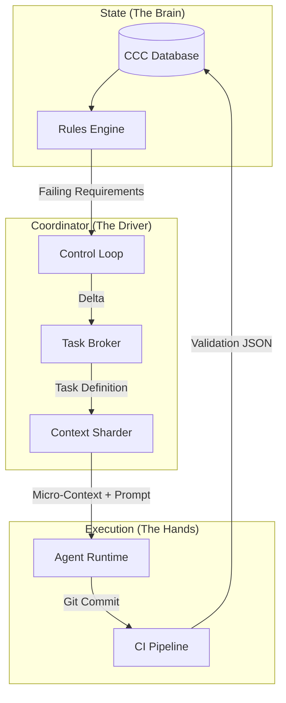

# CCC Coordinator – The Automation Engine

**Status:** Draft v1
**Context:** Extension of `CCC.MD`
**Purpose:** Defines the non-AI "Driver" layer that automates the software delivery lifecycle by dispatching ephemeral AI agents.

---

## 1. The Philosophy: Deterministic Management

The Central Control Center (CCC) provides the **Truth** (State). The Coordinator provides the **Action** (State Transitions).

### Core Rules
1. **AI is the Worker, Code is the Manager.**
   - High-level logic, phase transitions, and task assignment are handled by deterministic Typescript code, not an LLM.
2. **Ephemeral Agents.**
   - Agents are spun up for a single, atomic task (e.g., "Fix Validator X") and terminated immediately upon completion. They have no long-term memory.
3. **Context Sharding.**
   - Agents are never given the full repository context. They receive a "Micro-Context" containing only the files necessary for their specific task to prevent regression/hallucination.
4. **Loop-Based Execution.**
   - The system runs on a continuous control loop: `Observe (CCC) -> Diff -> Dispatch -> Verify`.

---

## 2. Architecture



---

## 3. The Task Broker

The Task Broker translates abstract `failing_requirements` (from CCC) into executable `delivery_tasks`.

### 3.1 Mapping Logic (Examples)

| CCC Failing Requirement | Detected Delta | Generated Task Type |
|-------------------------|----------------|---------------------|
| `Phase 2: Missing Endpoint in Registry` | `GET /users` in OpenAPI but not in `ENDPOINTS.json` | `TASK_REGISTER_ENDPOINT` |
| `Phase 3: Endpoint Status = PLANNED` | `POST /login` exists in Registry but code is missing | `TASK_IMPLEMENT_ENDPOINT` |
| `Phase 4: Validator Failed` | `validate-auth.ts` failed on step 3 | `TASK_FIX_VALIDATOR` |
| `Phase 5: Spec-Script Coverage < 100%` | Spec step "Login" has no script call | `TASK_EXTEND_SCRIPT` |

### 3.2 Database Extension

New table: `delivery_task`
- `id` (UUID)
- `project_id` (FK)
- `phase_number` (Int)
- `blocking_requirement_id` (FK to `phase_requirement`)
- `task_type` (Enum: `IMPLEMENT`, `FIX`, `WRITE_SPEC`, etc.)
- `target_artifact` (String: e.g., "src/modules/auth/auth.controller.ts")
- `status` (PENDING, ASSIGNED, COMPLETED, FAILED)
- `attempt_count` (Int)

---

## 4. Context Sharding (The Anti-Regression Layer)

To prevent agents from breaking unrelated code, the Coordinator explicitly constructs the file context for each task.

### 4.1 The "Micro-Context" Strategy

When dispatching an agent, the Coordinator passes a whitelist of allowed files. The Agent Runtime enforces that the agent cannot edit outside this list.

**Example: Implementing `POST /channels` (Phase 3)**

| Included Context | Rationale | Access Level |
|------------------|-----------|--------------|
| `docs/user-stories/03-channels.md` | Requirements | Read-Only |
| `docs/business-rules/03-channels.md` | Constraints | Read-Only |
| `openapi/paths/channels.yaml` | Contract | Read-Only |
| `src/modules/channels/dto/` | Data shapes | Read-Write |
| `src/modules/channels/controllers/` | Logic | Read-Write |
| `src/modules/channels/services/` | Business Logic | Read-Write |
| **EVERYTHING ELSE** | **Hidden / Ignored** | **No Access** |

**Why this works:**
The agent *cannot* accidentally refactor the Auth module while working on Channels, because it doesn't even know the Auth module exists.

---

## 5. The Agent Runtime Interface

The Coordinator needs a standardized way to invoke agents.

### 5.1 Agent Protocol
The Coordinator invokes an agent process (e.g., via Docker or a sandboded CLI) with a JSON payload:

```json
{
  "task_id": "task-123",
  "goal": "Implement the POST /channels endpoint to satisfy AC-US-301-1.",
  "constraints": [
    "Must pass npm run endpoints:validate",
    "Must use Transaction Rollback pattern",
    "Must use snake_case for DTOs"
  ],
  "context_files": [
    "docs/user-stories/03-channels.md",
    "openapi/paths/channels.yaml"
  ],
  "allowed_edit_paths": [
    "src/modules/channels/**"
  ],
  "validation_command": "npm run validation:channels"
}
```

### 5.2 The Feedback Loop
1. **Spawn:** Coordinator starts Agent with payload.
2. **Work:** Agent edits files.
3. **Self-Check:** Agent runs `validation_command` (enforced by local hook).
4. **Commit:** Agent commits code.
5. **Exit:** Agent process terminates.
6. **Verify:** CCC Ingestion picks up the commit -> Rules Engine updates state.

---

## 6. The Coordinator Control Loop

This service runs perpetually (e.g., as a Temporal Workflow or BullMQ processor).

### Pseudocode

```typescript
async function runCoordinatorLoop(projectId: string) {
  // 1. Get Truth
  const phases = await ccc.getPhaseStatuses(projectId);
  const activePhase = phases.find(p => p.status !== 'CLEAN');

  if (!activePhase) {
    logger.info('Project Complete');
    return;
  }

  // 2. Identify Blockers
  const blockers = activePhase.failing_requirements;
  if (blockers.length === 0) {
    // Edge case: Status computed CLEAN, but loop logic sees it.
    // Action: Trigger Phase Transition (git tag, notify PM).
    await triggerPhaseTransition(projectId, activePhase.number);
    return;
  }

  // 3. Broker Tasks
  const tasks = await taskBroker.generateTasks(blockers);

  // 4. Dispatch (Concurrency Limit = 1 for safety, higher for speed)
  for (const task of tasks) {
    if (await canExecute(task)) {
      const microContext = await contextSharder.build(task);
      await agentRuntime.dispatch(task, microContext);
      
      // Wait for ingestion before next loop tick
      await waitForIngestion(projectId);
    }
  }
}
```

---

## 7. Handling Failures (The "Stuck" Agent)

If an agent fails a task (e.g., CI fails, or task times out):

1. **Retry Counter:** Increment `attempt_count`.
2. **Context Expansion (Optional):** If failure reason is "Missing Dependency", slightly expand the micro-context (e.g., include `src/common`).
3. **Escalation:** If `attempt_count > 3`, mark task as `NEEDS_HUMAN` and alert the PM via Dashboard. The system pauses on this task but continues others.

---

## 8. Implementation Steps

1. **Task Broker Implementation:**
   - Write mapping logic to convert `validation-registry.json` failures into structured Task objects.
2. **Context Map Builder:**
   - Create a utility that maps "Feature X" to "List of Files for Feature X" (dependency graph).
3. **Agent CLI Wrapper:**
   - A simple wrapper around the AI tool that accepts the JSON protocol and enforces the file restrictions.
