# Chain of Trust Flow

The enforcement mechanism - how the system prevents skipping validations.

> **Core Principle:** Status is COMPUTED from evidence, never CLAIMED by agents.

```mermaid
%%{init: {'theme': 'base', 'themeVariables': { 'primaryColor': '#4a90d9', 'lineColor': '#333', 'secondaryColor': '#f8f9fa'}}}%%

flowchart TB
    %% TRIGGER: AGENT MAKES CHANGES

    START(("🚀 Agent<br/>Makes Changes"))

    %% WHAT WAS CHANGED?

    subgraph Changes["📝 WHAT WAS CHANGED?"]
        direction TB
        CH_SRC["src/ files<br/>(controllers, services, DTOs)"]
        CH_SCRIPT["scripts/ files<br/>(validators, utilities)"]
        CH_SPEC["docs/ files<br/>(specs, stories, rules)"]
        CH_CONTRACT["openapi/ files<br/>(API contracts)"]
    end

    START --> Changes

    %% ENFORCEMENT POINT 1: MUST RUN VALIDATORS

    subgraph Enforcement1["🔴 ENFORCEMENT POINT 1: Run Validators"]
        direction TB
        RUN_VAL["Run validation scripts<br/>npm run validation:all<br/>or specific: npm run validation:channels"]

        subgraph WhatValidatorsCheck["📋 What Validators Check"]
            VC1["✓ UX spec steps match backend behavior"]
            VC2["✓ Request/response match DTOs"]
            VC3["✓ Expected status codes received"]
            VC4["✓ Business rules enforced"]
        end

        RUN_VAL --> WhatValidatorsCheck
    end

    Changes --> |"REQUIRED"| RUN_VAL

    %% VALIDATOR OUTCOMES

    VAL_PASS["✅ Validators PASS"]
    VAL_FAIL["❌ Validators FAIL"]

    WhatValidatorsCheck --> VAL_PASS
    WhatValidatorsCheck --> VAL_FAIL

    %% FAILURE PATH: WHAT TO FIX

    subgraph FailurePath["⚠️ WHEN VALIDATORS FAIL"]
        direction TB

        subgraph FailType["Failure Type"]
            FT1["Backend bug<br/>(code doesn't match spec)"]
            FT2["Contract mismatch<br/>(DTO ≠ OpenAPI)"]
            FT3["Missing coverage<br/>(endpoint not tested)"]
            FT4["Spec incorrect<br/>(wrong expectations)"]
        end

        subgraph FixAction["Required Fix"]
            FA1["Fix backend code<br/>then re-run validator"]
            FA2["Align OpenAPI + DTO<br/>then re-run validator"]
            FA3["Add spec scenario<br/>then re-run validator"]
            FA4["Update spec from contract<br/>then re-run validator"]
        end

        FT1 --> FA1
        FT2 --> FA2
        FT3 --> FA3
        FT4 --> FA4
    end

    VAL_FAIL --> FailurePath
    FailurePath --> |"LOOP UNTIL PASS"| RUN_VAL

    %% SUCCESS PATH: REGISTRY UPDATE

    subgraph RegistryUpdate["📊 REGISTRY UPDATES AUTOMATICALLY"]
        direction TB
        REG[("validation-registry.json")]

        subgraph RecordedData["What Gets Recorded"]
            RD1["• lastRun: ISO timestamp"]
            RD2["• passed: true/false"]
            RD3["• totalTests: count"]
            RD4["• gitCommit: current HEAD"]
            RD5["• duration: milliseconds"]
        end

        REG --> RecordedData
    end

    VAL_PASS --> |"reportValidationResult()"| RegistryUpdate

    %% ENFORCEMENT POINT 2: COMMIT BLOCKED WITHOUT VALIDATION

    subgraph Enforcement2["🔴 ENFORCEMENT POINT 2: Pre-Commit Hook"]
        direction TB
        COMMIT_ATTEMPT["Agent runs: git commit"]

        subgraph HookChecks["🪝 Claude Hook Checks"]
            HC1["1. Is this git commit command?"]
            HC2["2. Were src/ or scripts/ modified?"]
            HC3["3. Were validations run this session?"]
        end

        COMMIT_ATTEMPT --> HookChecks
    end

    RegistryUpdate --> |"Agent tries to commit"| COMMIT_ATTEMPT

    %% Hook decision
    HOOK_APPROVE["✅ COMMIT APPROVED<br/>Validations were run"]
    HOOK_DENY["❌ COMMIT DENIED<br/>Run npm run validation:all"]

    HookChecks --> |"All checks pass"| HOOK_APPROVE
    HookChecks --> |"No validation run"| HOOK_DENY
    HOOK_DENY --> |"MUST RUN"| RUN_VAL

    %% ENFORCEMENT POINT 3: PHASE GATES

    subgraph Enforcement3["🔴 ENFORCEMENT POINT 3: Phase Gates"]
        direction TB
        PHASE_CLAIM["Agent claims: Phase X complete"]
        GATE_CHECK["Run: npm run validation:gates"]

        subgraph GateLogic["🚧 Gate Checks Registry"]
            GL1["For each required validator:"]
            GL2["• Has it run? (lastRun ≠ null)"]
            GL3["• Did it pass? (passed = true)"]
            GL4["• Is it fresh? (gitCommit = HEAD)"]
        end

        PHASE_CLAIM --> GATE_CHECK
        GATE_CHECK --> GateLogic
    end

    HOOK_APPROVE --> |"Agent claims phase done"| PHASE_CLAIM

    %% Gate decision
    GATE_PASS["✅ PHASE COMPLETE<br/>All validators pass"]
    GATE_BLOCKED["❌ PHASE BLOCKED"]

    GateLogic --> |"All requirements met"| GATE_PASS
    GateLogic --> |"Missing/failed/stale"| GATE_BLOCKED

    subgraph BlockedReasons["Why Phase Is Blocked"]
        BR1["🔴 Missing: Validators never run"]
        BR2["🔴 Failed: Validators returned errors"]
        BR3["🔴 Stale: Results from old commits"]
    end

    GATE_BLOCKED --> BlockedReasons
    BlockedReasons --> |"MUST FIX"| RUN_VAL

    %% PM VISIBILITY

    subgraph PMVisibility["👁️ PM VISIBILITY (Dashboard)"]
        direction TB
        DASH["PM Dashboard reads registry directly"]

        subgraph WhatPMSees["What PM Sees"]
            PS1["• Real-time validator status"]
            PS2["• Phase gate status (green/blocked)"]
            PS3["• Last run timestamps"]
            PS4["• Git commits for each run"]
            PS5["• Evidence trail (logs)"]
        end

        DASH --> WhatPMSees
    end

    RegistryUpdate --> |"Dashboard reads"| DASH
    GateLogic --> |"Gate status"| DASH

    %% FINAL SUCCESS

    SUCCESS(("✅ Phase<br/>Truly Complete"))
    GATE_PASS --> SUCCESS
```

## Key Principle

| Traditional (Trust-Based) | Chain of Trust (Evidence-Based) |
|--------------------------|--------------------------------|
| Agent says "tests passed" | System computes status from registry |
| PM believes agent | PM verifies via dashboard |
| Completion is claimed | Completion is proven |
| Trust is required | Only evidence matters |
