```mermaid
%%{init: {'theme': 'base', 'themeVariables': { 'primaryColor': '#4a90d9', 'lineColor': '#333'}}}%%

flowchart TB
    %% PHASE 1 SCRIPTS

    subgraph Phase1Scripts["📖 PHASE 1: Stories & Rules"]
        direction TB

        subgraph BRC["check-business-rules-coverage.ts"]
            BRC_CMD["npx ts-node docs/test-plans/scripts/<br/>check-business-rules-coverage.ts"]
            BRC_WHEN["🕐 WHEN: After creating/editing<br/>user stories or business rules"]
            BRC_CHECKS["🔍 CHECKS:<br/>• Every US-xxx has at least one BR-xxx<br/>• Every BR-xxx is referenced by US-xxx<br/>• No undefined BR-xxx IDs"]
            BRC_FAIL["❌ FIX:<br/>• Stories missing rules → Add BR-xxx refs<br/>• Unreferenced rules → Link from story<br/>• Undefined rules → Create rule or fix typo"]
        end
    end

    %% PHASE 2 SCRIPTS

    subgraph Phase2Scripts["📋 PHASE 2: Contracts & Registry"]
        direction TB

        subgraph EPV["endpoints:validate"]
            EPV_CMD["npm run endpoints:validate"]
            EPV_WHEN["🕐 WHEN: After modifying controllers,<br/>DTOs, or OpenAPI specs"]
            EPV_CHECKS["🔍 CHECKS:<br/>• Controllers match OpenAPI paths<br/>• All endpoints have story refs<br/>• Generates ENDPOINTS.json"]
            EPV_FAIL["❌ FIX:<br/>• Missing → Implement controller route<br/>• Unclassified → Add OpenAPI + story ref<br/>• No story → Add endpoint to user story"]
        end

        subgraph DMV["validate-documentation-matrix.ts"]
            DMV_CMD["npx ts-node docs/test-plans/scripts/<br/>validate-documentation-matrix.ts"]
            DMV_WHEN["🕐 WHEN: After adding endpoints<br/>to stories or rules"]
            DMV_CHECKS["🔍 CHECKS:<br/>• Endpoints in stories exist in registry<br/>• Endpoints in rules exist in registry<br/>• No orphan endpoints"]
            DMV_FAIL["❌ FIX:<br/>• Not in stories → Add ref to US-xxx<br/>• Not in rules → Add ref to BR-xxx<br/>• Undefined → Fix typo or implement"]
        end
    end

    %% PHASE 4 SCRIPTS

    subgraph Phase4Scripts["📝 PHASE 4: UX Specs"]
        direction TB

        subgraph SCV["check-story-coverage.ts"]
            SCV_CMD["npx ts-node scripts/<br/>check-story-coverage.ts"]
            SCV_WHEN["🕐 WHEN: After writing UX specs"]
            SCV_CHECKS["🔍 CHECKS:<br/>• Every US-xxx in at least one<br/>spec's Covered Stories section"]
            SCV_FAIL["❌ FIX:<br/>• Missing US-xxx → Add to Covered Stories<br/>• Write scenario exercising the story"]
        end

        subgraph ECV["check-endpoint-coverage.ts"]
            ECV_CMD["npx ts-node scripts/<br/>check-endpoint-coverage.ts"]
            ECV_WHEN["🕐 WHEN: Before claiming Phase 4 done<br/>🚨 GATE: Must be 100%"]
            ECV_CHECKS["🔍 CHECKS:<br/>• Every endpoint in ENDPOINTS.json<br/>called by at least one UX spec step"]
            ECV_FAIL["❌ FIX:<br/>• Add spec scenario that calls endpoint<br/>• Create new spec file if needed<br/>• Cannot proceed until 100%"]
        end
    end

    %% PHASE 5 SCRIPTS

    subgraph Phase5Scripts["🧪 PHASE 5: Validators"]
        direction TB

        subgraph SSCV["check-spec-script-coverage.ts"]
            SSCV_CMD["npx ts-node scripts/<br/>check-spec-script-coverage.ts"]
            SSCV_WHEN["🕐 WHEN: After creating validation scripts<br/>🚨 GATE: Must be 100%"]
            SSCV_CHECKS["🔍 CHECKS:<br/>• Every spec has validate-*-full.ts<br/>• Every spec step has script call"]
            SSCV_FAIL["❌ FIX:<br/>• Spec no script → Create validate-X-full.ts<br/>• Missing steps → Add API calls to script"]
        end

        subgraph VAL["validate-*-full.ts"]
            VAL_CMD["npm run validation:all<br/>or: npm run validation:auth"]
            VAL_WHEN["🕐 WHEN: After code changes,<br/>BEFORE commit"]
            VAL_CHECKS["🔍 CHECKS:<br/>• Backend returns expected responses<br/>• Status codes match spec<br/>• Business rules enforced"]
            VAL_FAIL["❌ FIX:<br/>• Status mismatch → Fix backend or spec<br/>• Field missing → Fix DTO or logic<br/>• 500 error → Debug backend bug<br/>• Check logs in scripts/validation/logs/"]
        end
    end

    %% ENFORCEMENT SCRIPTS

    subgraph EnforcementScripts["🔐 ENFORCEMENT"]
        direction TB

        subgraph GATES["validation:gates"]
            GATES_CMD["npm run validation:gates"]
            GATES_WHEN["🕐 WHEN: Before claiming<br/>any phase complete"]
            GATES_CHECKS["🔍 CHECKS:<br/>• All required validators have run<br/>• All required validators passed<br/>• Results from current git commit"]
            GATES_FAIL["❌ FIX:<br/>• Missing → Run the validator<br/>• Failed → Fix failures, re-run<br/>• Stale → Re-run on current commit"]
        end
    end

    Phase1Scripts --> Phase2Scripts
    Phase2Scripts --> Phase4Scripts
    Phase4Scripts --> Phase5Scripts
    Phase5Scripts --> EnforcementScripts
```

# Validation Scripts Quick Reference

When to run each script, what it checks, and what to do when it fails.

## Quick Commands

| Command | Purpose |
|---------|---------|
| `npm run validation:all` | Run ALL validators |
| `npm run validation:auth` | Run auth validator only |
| `npm run validation:gates` | Check phase completion |
| `npm run endpoints:validate` | Regenerate endpoint registry |
| `./scripts/validation/run-all-with-logs.sh` | Full suite with logging |

---

---

## Failure Remediation by Phase

### Phase 1 Failures

| Failure | Cause | Fix |
|---------|-------|-----|
| Stories missing rules | US-xxx has no BR-xxx ref | Add business rule reference to story |
| Unreferenced rules | BR-xxx not linked from any story | Link from relevant story or deprecate |
| Undefined rules | Typo in BR-xxx ID | Create the rule or fix the typo |

### Phase 2 Failures

| Failure | Cause | Fix |
|---------|-------|-----|
| Missing endpoint | OpenAPI defined but no controller | Implement the controller route |
| Unclassified endpoint | Controller exists but no docs | Add OpenAPI spec + story reference |
| Not in stories | Endpoint has no US-xxx reference | Add to user story API Endpoints section |
| Naming violation | Field doesn't follow convention | Rename to snake_case (body) or camelCase (path) |

### Phase 4 Failures

| Failure | Cause | Fix |
|---------|-------|-----|
| Story not covered | US-xxx missing from all specs | Add to Covered Stories + write scenario |
| Endpoint not covered | No spec step calls the endpoint | Add spec scenario that exercises it |
| Field not in DTO | Spec uses unknown field | Remove from spec or add to OpenAPI/DTO |

### Phase 5 Failures

| Failure | Cause | Fix |
|---------|-------|-----|
| Spec has no script | Missing validate-*-full.ts | Create the validation script |
| Script missing steps | Fewer API calls than spec steps | Add missing API calls to script |
| Assertion failed | Backend behavior differs | Fix backend bug or reconcile spec |
| 500 error | Backend exception | Debug and fix the backend code |
