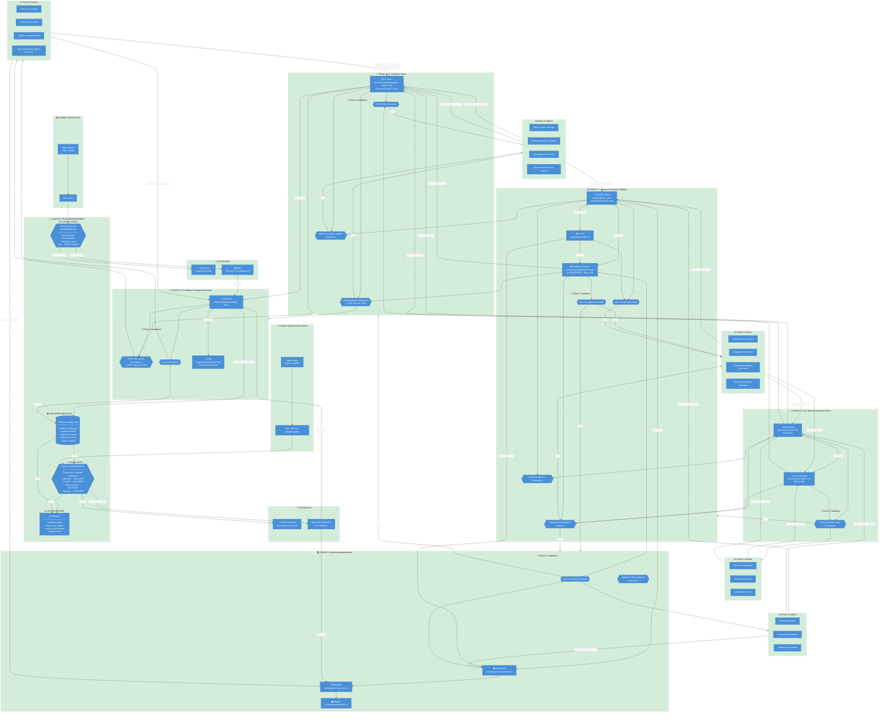

# Validation System Diagram

Complete visualization of the self-checking reinforcement system - phases, validations, and enforcement.

```mermaid
%%{init: {'theme': 'base', 'themeVariables': { 'primaryColor': '#4a90d9', 'primaryTextColor': '#fff', 'primaryBorderColor': '#2e6eb8', 'lineColor': '#333', 'secondaryColor': '#f4f4f4', 'tertiaryColor': '#d4edda', 'errorBorderColor': '#dc3545', 'errorBkgColor': '#f8d7da'}}}%%

flowchart TB
    %% PHASE 1: USER STORIES & BUSINESS RULES

    subgraph Phase1["📖 PHASE 1: User Stories & Business Rules"]
        direction TB
        US["📄 User Stories<br/>docs/user-stories/*.md<br/>US-xxx IDs"]
        BR["📜 Business Rules<br/>docs/business-rules/*.md<br/>BR-xxx IDs"]

        US <-->|"references"| BR

        subgraph P1_Validation["✓ Phase 1 Validation"]
            BRC{{"check-business-rules-coverage.ts"}}
        end

        US --> BRC
        BR --> BRC
    end

    subgraph P1_Fail["⚠️ Phase 1 Failures"]
        P1F1["Stories missing rules"]
        P1F2["Unreferenced rules"]
        P1F3["Undefined rule IDs"]
    end

    BRC -->|"FAIL"| P1_Fail
    P1_Fail -->|"FIX: Add/link BR-xxx"| BR
    P1_Fail -->|"FIX: Add US-xxx refs"| US
    BRC -->|"PASS"| Phase2

    %% PHASE 2: CONTRACTS & ENDPOINT REGISTRY

    subgraph Phase2["📋 PHASE 2: Contracts & Endpoint Registry"]
        direction TB
        OA["📑 OpenAPI Specs<br/>openapi/paths/*.yaml<br/>openapi/schemas/*.yaml"]
        DTO["📦 DTOs<br/>src/modules/*/dto/*.ts"]
        EP["📊 Endpoint Registry<br/>architecture/ENDPOINTS.json<br/>⚠️ GENERATED - Never edit"]

        OA <-->|"must match"| DTO
        OA -->|"generates"| EP
        DTO -->|"generates"| EP

        subgraph P2_Validation["✓ Phase 2 Validations"]
            EPV{{"npm run endpoints:validate"}}
            DMV{{"validate-documentation-matrix.ts"}}
            ACV{{"check-acceptance-coverage.ts"}}
            NMV{{"npm run validate:naming"}}
        end

        EP --> EPV
        EP --> DMV
        US --> DMV
        BR --> DMV
        OA --> ACV
        US --> ACV
        OA --> NMV
        DTO --> NMV
    end

    subgraph P2_Fail["⚠️ Phase 2 Failures"]
        P2F1["Endpoints not in stories"]
        P2F2["Endpoints not in rules"]
        P2F3["Undefined endpoints referenced"]
        P2F4["Naming convention violations"]
    end

    EPV -->|"FAIL"| P2_Fail
    DMV -->|"FAIL"| P2_Fail
    NMV -->|"FAIL"| P2_Fail
    P2_Fail -->|"FIX: Update OpenAPI"| OA
    P2_Fail -->|"FIX: Update stories"| US
    P2_Fail -->|"FIX: Update rules"| BR
    EPV -->|"PASS"| Phase3
    DMV -->|"PASS"| Phase3

    %% PHASE 3: BACKEND IMPLEMENTATION

    subgraph Phase3["💻 PHASE 3: Backend Implementation"]
        direction TB
        CTRL["🎮 Controllers<br/>src/modules/*/controllers/*.ts"]
        SVC["⚙️ Services<br/>src/modules/*/services/*.ts"]
        MDL["🗃️ Models<br/>src/database/models/*.ts"]

        OA -->|"contract for"| CTRL
        DTO -->|"defines payloads"| CTRL
        CTRL --> SVC
        SVC --> MDL

        subgraph P3_Validation["✓ Phase 3 Validations"]
            EPV3{{"npm run endpoints:validate"}}
            UXC{{"validate-ux-specs-against-contracts.ts"}}
        end

        CTRL --> EPV3
        EP --> EPV3
    end

    subgraph P3_Fail["⚠️ Phase 3 Failures"]
        P3F1["Missing endpoints"]
        P3F2["Unclassified endpoints"]
        P3F3["Contract mismatches"]
    end

    EPV3 -->|"FAIL"| P3_Fail
    P3_Fail -->|"FIX: Implement controller"| CTRL
    P3_Fail -->|"FIX: Add OpenAPI spec"| OA
    P3_Fail -->|"FIX: Add story reference"| US
    EPV3 -->|"PASS"| Phase4

    %% PHASE 4: UX VALIDATION SPECS

    subgraph Phase4["📝 PHASE 4: UX Validation Specs"]
        direction TB
        UXS["📋 UX Specs<br/>docs/test-plans/validation-specs/*.md<br/>Covered Stories: US-xxx"]

        US -->|"derives scenarios"| UXS
        BR -->|"defines constraints"| UXS
        EP -->|"provides endpoints"| UXS

        subgraph P4_Validation["✓ Phase 4 Validations"]
            SCV{{"check-story-coverage.ts"}}
            ECV{{"check-endpoint-coverage.ts<br/>🔴 GATE: Must be 100%"}}
            UXV{{"validate-ux-specs-against-contracts.ts"}}
        end

        UXS --> SCV
        US --> SCV
        UXS --> ECV
        EP --> ECV
        UXS --> UXV
        OA --> UXV
    end

    subgraph P4_Fail["⚠️ Phase 4 Failures"]
        P4F1["Missing story coverage"]
        P4F2["Missing endpoint coverage"]
        P4F3["Spec fields not in DTOs"]
        P4F4["Spec endpoints not in registry"]
    end

    SCV -->|"FAIL"| P4_Fail
    ECV -->|"FAIL"| P4_Fail
    UXV -->|"FAIL"| P4_Fail
    P4_Fail -->|"FIX: Add Covered Stories"| UXS
    P4_Fail -->|"FIX: Add spec scenarios"| UXS
    P4_Fail -->|"FIX: Align with OpenAPI"| OA
    ECV -->|"PASS"| Phase5

    %% PHASE 5: UX VALIDATION SCRIPTS & EXECUTION

    subgraph Phase5["🧪 PHASE 5: UX Validation Scripts & Execution"]
        direction TB
        VAL["🔧 Validators<br/>scripts/validation/validate-*-full.ts"]
        LOG["📜 Logs<br/>scripts/validation/logs/*.log<br/>Full request/response"]

        UXS -->|"implements"| VAL
        VAL -->|"generates"| LOG

        subgraph P5_Validation["✓ Phase 5 Validations"]
            SSCV{{"check-spec-script-coverage.ts<br/>🔴 GATE: Must be 100%"}}
            RUNALL{{"run-all-with-logs.sh"}}
        end

        UXS --> SSCV
        VAL --> SSCV
        VAL --> RUNALL
    end

    subgraph P5_Fail["⚠️ Phase 5 Failures"]
        P5F1["Spec has no script"]
        P5F2["Script missing steps"]
        P5F3["Validator assertion failed"]
        P5F4["Backend behavior differs from spec"]
    end

    SSCV -->|"FAIL"| P5_Fail
    RUNALL -->|"FAIL"| P5_Fail
    P5_Fail -->|"FIX: Create/update script"| VAL
    P5_Fail -->|"FIX: Backend bug"| SVC
    P5_Fail -->|"FIX: Reconcile spec/contract"| UXS

    %% CHAIN OF TRUST: REGISTRY, GATES, HOOKS

    subgraph ChainOfTrust["🔐 CHAIN OF TRUST ENFORCEMENT"]
        direction TB

        subgraph Registry["📊 VALIDATION REGISTRY"]
            REG[("validation-registry.json<br/>───────────────<br/>• lastRun: timestamp<br/>• passed: boolean<br/>• totalTests: number<br/>• gitCommit: hash<br/>• runBy: script/ci")]
        end

        subgraph Gates["🚧 PHASE GATES"]
            PG{{"npm run validation:gates<br/>───────────────<br/>Checks ALL required validators:<br/>• Missing? → BLOCKED<br/>• Failed? → BLOCKED<br/>• Stale commit? → BLOCKED<br/>• All pass → PROCEED"}}
        end

        subgraph Hooks["🪝 CLAUDE HOOKS"]
            CH{{"PreToolUse Hook<br/>.claude/hooks.json<br/>───────────────<br/>On git commit:<br/>• src/ changed?<br/>• validations run?<br/>• No → DENY COMMIT"}}
        end

        subgraph Dashboard["📈 PM DASHBOARD"]
            DASH["Dashboard<br/>───────────────<br/>• Validator status<br/>• Phase gate status<br/>• Last run timestamps<br/>• Evidence trail"]
        end
    end

    %% Registry connections
    VAL -->|"reportValidationResult()"| REG
    RUNALL -->|"updates"| REG
    REG -->|"reads"| PG
    REG -->|"reads"| DASH
    PG -->|"informs"| DASH

    %% COMMIT FLOW

    subgraph CommitFlow["📤 COMMIT WORKFLOW"]
        direction TB
        CODE["Agent makes<br/>code changes"]
        COMMIT["git commit"]

        CODE --> COMMIT
    end

    COMMIT --> CH

    subgraph HookDecision["🚦 Hook Decision"]
        APPROVE["✅ APPROVE<br/>Commit proceeds"]
        DENY["❌ DENY<br/>Run npm run validation:all"]
    end

    CH -->|"validations run"| APPROVE
    CH -->|"no validations"| DENY
    DENY -->|"must run"| VAL

    %% PHASE COMPLETION FLOW

    subgraph PhaseCompletion["✅ PHASE COMPLETION CHECK"]
        direction TB
        CLAIM["Agent claims<br/>phase complete"]
        GATE_CHECK["Run: npm run validation:gates"]

        CLAIM --> GATE_CHECK
    end

    GATE_CHECK --> PG

    subgraph GateDecision["🚦 Gate Decision"]
        PASSED["✅ PHASE PASSED<br/>Proceed to next phase"]
        BLOCKED["❌ PHASE BLOCKED<br/>Fix validators"]
    end

    PG -->|"all pass"| PASSED
    PG -->|"missing/failed/stale"| BLOCKED
    BLOCKED -->|"run missing"| VAL
    BLOCKED -->|"fix failures"| SVC
```
